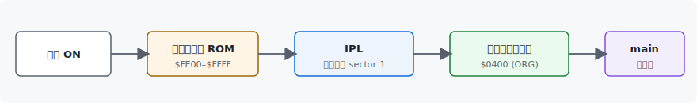
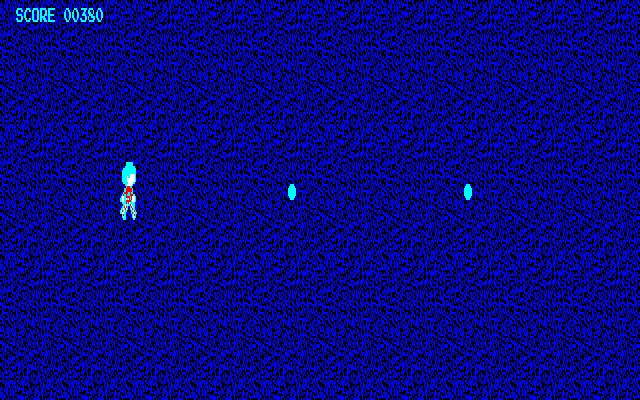
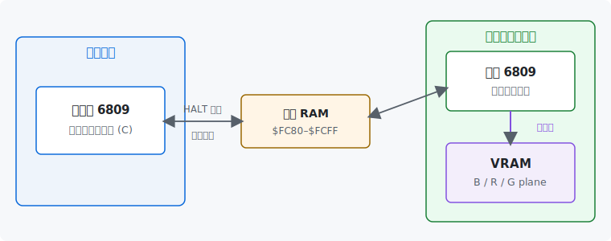
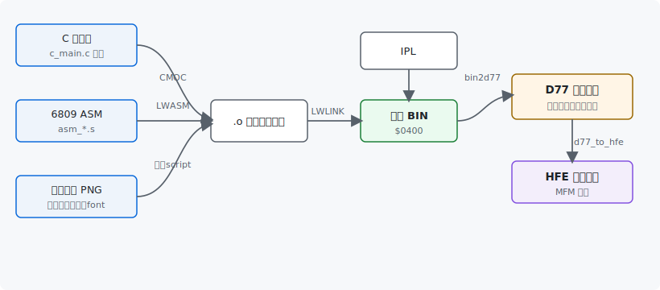

# FM7BaseCode — CMOC + LWASM で FM-7 / FM77AV 用プログラムを作るベーステンプレート

FM-7 / FM77AV (および AV40 / AV40EX) で動くプログラムを、 現代的な PC 上で **C 言語と 6809 アセンブラを併用** しながら開発するためのベーステンプレートです。

> **想定読者**: すでに FM-7 / FM77AV の互換エミュレータを起動でき、 ゲームで遊んだり BASIC プログラムを入力したりといったことができていて、 今度は自分で C やマシン語でプログラムを作ってみたい方。 **自作の D77 ディスクイメージをエミュレータで動かす**ことをゴールに説明します。

- 開発ホスト: **Windows (WSL2) / macOS / Linux** のいずれか (エディタは任意)
- ターゲット: FM-7 / FM77AV 互換エミュレータ。 生成物の **D77 ディスクイメージ**を動かす
- ツールチェイン: **CMOC** (6809 向け C コンパイラ) + **LWASM/LWLINK** (LWTOOLS の 6809 アセンブラ/リンカ)

`make` ひとつで自前のスタートアップから直接起動する D77 ディスクイメージが出来上がるので、 これを互換エミュレータのドライブ 0 にセットして電源 ON するだけで「内蔵ブート ROM → IPL → 本体プログラム」 の順に自動起動します。



## 雛形の動作内容

起動すると **`assets/backimage.png` (64x64 モノクロ) をタイル状に敷いた背景** の上に、 `assets/character.png` から取り込んだ **32x32 キャラ** (赤/シアン/白) が表示されます。 **テンキー 8/2/4/6** で上下左右に連続移動 (= 一度押した方向にずっと進む、 別の方向キーで向きを変える、 それ以外のキーで停止)、 歩くと**足が動くアニメ**、 透明部分には背景が透けます。 **BREAK キー** で向いている方向へシアンのボールを投げます (最大 3 連射)。 画面上部にはシアンの **「SCORE 0000」** 表示。 画面端では止まります。 **PSG サウンド**で単音 BGM が流れ、 発射時はノイズの発射音、 歩くと足音が鳴ります。



描画は サブシステム ROM の標準 PRINT 経由ではなく、 **自前のサブプログラムを sub の RAM に転送して VRAM 直書きで** 行っています。



## 📖 はじめての方へ — 入門マニュアル

**[docs/TUTORIAL.md](docs/TUTORIAL.md)** が入門マニュアルです。 「FM-7 ってどういうマシン?」 から「このテンプレを改造して自分のゲームを作る」 まで、 順を追って解説しています。 **まずはこれを通読**してください。 以下の各ドキュメントは、 そこから参照する詳細リファレンスです。

## ドキュメント構成

| ファイル | 内容 |
| --- | --- |
| **[docs/TUTORIAL.md](docs/TUTORIAL.md)** | **★入門マニュアル** (= アーキテクチャ → ビルド → 改造ハンズオン → 機能追加 → 罠 → 用語集)。 最初に読む |
| **README.md** (本ファイル) | 環境構築 / ビルド / 実行確認 |
| [docs/DETAIL.md](docs/DETAIL.md) | プロジェクト構成、 起動シーケンス、 Makefile の中身、 サブシステム仕様、 ハマりやすいポイント |
| [docs/GAMEMAIN.md](docs/GAMEMAIN.md) | `c_main.c` のゲームロジック解説 (起動シーケンス + メインループ) |
| [docs/GAMESUB.md](docs/GAMESUB.md) | アセンブラ部分 (IPL / crt0 / subsys helper / runtime / bootrom / yamauchi / subprog / kbd / font / sprite) の概要 |
| [docs/SUBPROGRAM.md](docs/SUBPROGRAM.md) | **自前サブプログラムによる独自描画の全貌** (= TEST 機構 + sub-side 描画 + sprite + テキスト + キー入力 + 起動シーケンス + サブシステムの勘所 Q&A) |
| [docs/SPRITE.md](docs/SPRITE.md) | sprite データ形式 (32x32 pixel、 前景 R/G 2 plane = 赤/シアン/白) と sprite_to_asm.py |
| [docs/TIMER.md](docs/TIMER.md) | フレームペーシング (メイン CPU の周期タイマ IRQ を数える deadline 方式) の仕組み |
| [docs/SOUND.md](docs/SOUND.md) | PSG (AY-3-8910) サウンド (発射音=ノイズ / 歩行音 / 単音 BGM) の仕組み |
| [docs/DEVICE.md](docs/DEVICE.md) | 機種判別と入力デバイス (FM 音源搭載判定 / ジョイスティック読み出し) の C API (`c_device`) |
| [docs/CMT.md](docs/CMT.md) | D77 から T77 テープイメージと WAV(FSK 音声)を作る `make t77` の仕組み (CMT ロード手順・FSK 変調・トランポリン多段ロード・サイズ上限) |
| [docs/TILEMAP.md](docs/TILEMAP.md) | タイルマップ背景の設計メモ (発展) |
| [docs/FONT.md](docs/FONT.md) | 同梱 8x8 font (Press Start 2P, OFL-1.1) のライセンス・生成パイプライン・データ仕様 |
| [CHANGELOG.md](CHANGELOG.md) | 主要な変更履歴 (日付ベース、 新しい順) |

| ツール | 役割 | 入手元 |
| --- | --- | --- |
| CMOC | 6809 向け C コンパイラ。 出力は LWASM 用アセンブラソース | <http://sarrazip.com/dev/cmoc.html> |
| LWASM | 6809/6309 アセンブラ | <http://www.lwtools.ca/> |
| LWLINK | LWASM 用リンカ | LWTOOLS に同梱 |

CMOC は内部で LWASM を呼び出すため、 両者をセットで導入します。

---

# 0. リポジトリを入手する (git clone / 更新)

本テンプレは GitHub で公開されているので、 **Git** で手元に取得します。 はじめての方は次の流れで OK です。

1. **GitHub アカウントを作る** (まだの方は <https://github.com/> で無料登録)。 公開リポジトリを取得するだけならアカウント無しでも可能ですが、 作っておくと後々便利です。
2. **Git を入れる**: 多くの環境には最初から入っていますが、 無ければ各 OS で導入します。
   - **macOS**: Xcode Command Line Tools に同梱 (`xcode-select --install` で入ります)。
   - **Linux**: パッケージ管理ツールで導入 (例: `sudo apt install git`)。
   - **Windows**: WSL2 の Ubuntu 内に `sudo apt install git` で導入 (本テンプレは WSL2 上で作業します)。
3. **リポジトリを取得する** (`git clone`):

```bash
git clone <リポジトリのURL>
```

4. **取得したディレクトリへ入る**:

```bash
cd FM7BaseCode
```

   あとは下の **§1 以降の手順**でツールチェインを入れ、 `make` でビルドします。
5. **後日、 本テンプレが更新されたら**、 リポジトリのディレクトリ内で最新を取り込み、 **ビルドし直します**。

```bash
git pull        # 最新の変更を取り込む
make            # 取り込んだ変更でビルドし直す (= 新しい D77 を作る)
```

   `git pull` しただけでは、 手元の `build/` は古いままです。 **必ず `make` で作り直して**から、 エミュレータで動作確認 (§3) してください。 うまく反映されない・ビルドが変なときは `make clean && make` で一度まっさらにして作り直します。

   > **自分でソースを編集している場合**: `git pull` で本体側の更新とあなたの変更がぶつかる (= コンフリクト) ことがあります。 安全に取り込むには、 自分の変更を先にコミットしておくか、 作業用ブランチ (例 `git switch -c mygame`) や フォークで進めるのがおすすめです。 Git の操作に不安があれば、 編集前のきれいな状態を別フォルダに `git clone` で取り分けておくだけでも安心です。

> `<リポジトリのURL>` には、 配布元 GitHub ページの **Code** ボタンから表示される URL を入れてください。

Git / GitHub の使い方そのものに本書では深入りしません。 もっと知りたい方は次を参照してください。

- **GitHub 公式ヘルプ (日本語)**: <https://docs.github.com/ja>
- 日本語の入門記事は **Qiita** (<https://qiita.com/>) や **Zenn** (<https://zenn.dev/>) で「git 入門」「github 入門」などで検索すると数多く見つかります。

---

# 1. 開発環境を整える (Windows WSL2 / macOS / Linux)

本テンプレは **CMOC + LWTOOLS (LWASM/LWLINK) + Python3(+Pillow)** さえ入れば、
**Windows (WSL2) / macOS / Linux** のどれでも同じように開発できます。 OS ごとの
下準備 (§1.1) とパッケージ導入 (§1.2) のうち、 自分の環境に合うものを 1 つ実施し、
そのあと LWTOOLS (§1.3) と CMOC (§1.4) を入れます (§1.3/§1.4 は全 OS 共通)。

## 1.1 OS 別の下準備

### Windows — WSL2 + Ubuntu
PowerShell (管理者) で WSL2 + Ubuntu を導入し、 以降は **WSL の Ubuntu シェル**で作業します。

```powershell
wsl --install -d Ubuntu-24.04
```

```bash
sudo apt update && sudo apt upgrade -y
```

### Linux (ネイティブ)
そのままターミナルで作業します。 パッケージは各ディストリの管理ツール (apt / dnf 等)。

### macOS
**Xcode Command Line Tools** (C コンパイラ / make) と **Homebrew** を用意します。

```bash
xcode-select --install     # 未導入なら
/bin/bash -c "$(curl -fsSL https://raw.githubusercontent.com/Homebrew/install/HEAD/install.sh)"   # Homebrew 未導入なら
```

## 1.2 ビルドに必要なパッケージ

ビルドには **make / C コンパイラ**と、 D77 化・font/sprite 変換スクリプト用の **Python3 + Pillow (PIL)** が要ります。 CMOC / LWTOOLS は配布 tarball を素の `./configure && make` でビルドできます (= parser 生成済みのため Bison/Flex 等は通常不要)。 **自分の OS の行を実行**してください。

**Debian / Ubuntu (WSL2 含む):**
```bash
sudo apt update
sudo apt install -y build-essential libboost-all-dev bison flex \
  texinfo git wget curl make autoconf automake python3 python3-pil
```

**Fedora / RHEL 系:**
```bash
sudo dnf install -y gcc gcc-c++ make boost-devel bison flex \
  texinfo git wget curl autoconf automake python3 python3-pillow
```

**macOS (Homebrew):**
```bash
brew install autoconf automake python3
python3 -m pip install --user pillow      # = python3-pil 相当 (= ダメなら venv か --break-system-packages)
```
macOS は **Xcode Command Line Tools** に `make` / C コンパイラ / `curl` が同梱されており、 これだけで CMOC / LWTOOLS の素の `./configure && make` が通ります (= 配布 tarball は parser 生成済みのため Bison/Flex は不要)。
> **任意 (上級者向け)**: ソースから parser を再生成したい場合のみ `brew install boost bison flex` を追加し、 **その作業時だけ** Homebrew 版 bison/flex を PATH 前段に通します:
> `export PATH="$(brew --prefix bison)/bin:$(brew --prefix flex)/bin:$PATH"`
> 通常のビルドでは不要です。

`python3-pil` (Pillow) は同梱 8x8 font の TTF→PNG ラスタライズに使います (= ビルド時に upstream から TTF を取得して派生物として生成。 詳細は [docs/FONT.md](docs/FONT.md))。 TTF 取得には `curl` (macOS 標準同梱、 Linux も大半が同梱) を用います。 初回 `make` だけネットワークが要り、 2 回目以降は DL 済みファイル再利用でオフライン可。

## 1.3 LWTOOLS (LWASM / LWLINK) のインストール — 全 OS 共通

LWTOOLS は公式サイトから tarball を取得してソースビルドします (Windows WSL2 / macOS / Linux 共通の手順)。 バージョンは執筆時点の例なので、 適宜置き換えてください。

```bash
cd ~
mkdir -p src && cd src
curl -L -O http://www.lwtools.ca/releases/lwtools/lwtools-4.22.tar.gz
tar xzf lwtools-4.22.tar.gz
cd lwtools-4.22
make
sudo make install
```

インストール後、 `lwasm --version` と `lwlink --version` が通れば OK です。 デフォルトでは `/usr/local/bin` に入ります。

## 1.4 CMOC のインストール — 全 OS 共通

CMOC も同様にソースから入れます (全 OS 共通)。 配布 tarball は parser 生成済みなので、 素の `./configure && make` で通ります (= Boost / Bison / Flex は不要)。

```bash
cd ~/src
curl -L -O http://sarrazip.com/dev/cmoc-0.1.98.tar.gz
tar xzf cmoc-0.1.98.tar.gz
cd cmoc-0.1.98
./configure
make
sudo make install
```

> **任意の補足**: 万一 `./configure` が Boost 等を要求する環境では、 Homebrew の場所を渡します:
> `./configure CPPFLAGS="-I$(brew --prefix boost)/include" LDFLAGS="-L$(brew --prefix boost)/lib"`

`cmoc --version` が通れば導入は完了です。 バージョン番号 (`0.1.98`) は適宜、 公式ページ掲載の最新版に読み替えてください。 配布元 `sarrazip.com` は作者の恒久 URL (permalink) で、 アクセス時に実際のホスティング先へ自動転送されます。 HTTP のみ対応 (HTTPS 非対応) です。

## 1.5 エディタ (任意)

エディタは何でも構いませんが、 はじめての方には **Visual Studio Code (VS Code)** がおすすめです (無料・全 OS 対応で、 C / Makefile / Markdown を扱いやすい)。 起動例:

- **Windows (WSL2)**: VS Code に拡張 **Remote - WSL** を入れ、 WSL のターミナルで
  プロジェクトへ移動して `code .` (= WSL 側のファイルを直接編集)。
- **macOS / Linux**: プロジェクトディレクトリで `code .` (= もしくは普段のエディタで開く)。

あわせて入れておくと便利な拡張:

- **C/C++** (インテリセンス用)
- **Makefile Tools**
- **6809 / Motorola syntax highlighting** 系 (任意)

### Markdown ドキュメントを見やすく読む

本テンプレの解説は `docs/` 以下に **Markdown** (`.md`) で置いてあります。 VS Code で `.md` ファイルを開き、 次のショートカットで**整形済みプレビュー**を開けます (表や図リンクが見やすくなります)。

- **macOS**: `⌘ + Shift + V`
- **Windows / Linux**: `Ctrl + Shift + V`

エディタの右上にある**プレビューアイコン**を押すと、 編集画面の横に並べて表示することもできます。 GitHub のリポジトリ画面でも `.md` は整形表示されるので、 ブラウザ上で読んでも構いません。

---

# 2. ビルド

## 2.1 プロジェクト設定 (config.mk)

普段書き換えるのは [config.mk](config.mk) だけで済むようになっています。

```make
NAME = hello
ORG  = 0x0400
```

| 変数 | 説明 |
| --- | --- |
| `NAME` | 生成される `build/<NAME>.bin` / `build/<NAME>.d77` のファイル名、 および D77 ディスクラベル |
| `ORG`  | 本体 main の開始アドレス。 Makefile が link スクリプトと IPL の `BODY_LOAD` 両方に自動反映する |

`ORG` を変更すると Makefile が link script と IPL アセンブルの両方に自動反映するので、 ソース側を書き換える必要はありません (詳細は [docs/DETAIL.md §4](docs/DETAIL.md#4-configmk--プロジェクト設定))。

## 2.2 ビルド実行

プロジェクトルートで `make` を実行するだけです。

```bash
make
```



`build/` 配下に成果物が生成されます。 主要なもの:

| パス | 役割 | サイズ |
| --- | --- | --- |
| `build/<NAME>.d77` | **エミュレータに投入するディスクイメージ** | — |
| `build/<NAME>.hfe` | D77 を MFM 変換した HFE 形式 (HxC Floppy Emulator) | — |
| `build/<NAME>.bin` | プログラム本体 (= IPL が `$ORG` に書き込む) | 任意 (最大 248 sector = 62 KB) |
| `build/ipl.bin` | IPL (= D77 sector 1 の中身) | < 256 byte |
| `build/bootrom.bin` | 自前ブート ROM (= 任意、 内蔵ブート ROM 代替) | 512 byte |

`.hfe` は `.d77` と同じ内容を HFE (HxC Floppy Emulator) 形式に変換したものです。 HFE のフォーマットは[公式仕様が公開されています](https://hxc2001.com/floppy_drive_emulator/HFE-file-format.html)。

## 2.3 make ターゲット一覧

| コマンド | 動作 |
| --- | --- |
| `make`         | デフォルト: BIN・D77・HFE・自前ブート ROM を全部作る |
| `make bin`     | 本体 BIN (`build/<NAME>.bin`) だけ作る |
| `make bootrom` | 自前ブート ROM (`build/bootrom.bin`) だけ作る |
| `make t77`     | テープ用成果物 (T77 / WAV(FSK 音声) / 操作手順テキスト) を D77 から変換生成 (詳細は [docs/CMT.md](docs/CMT.md)) |
| `make clean`   | `build/` をまるごと削除 |

ビルドフローの詳しい中身は [docs/DETAIL.md §5](docs/DETAIL.md#5-makefile-の中で起きていること) を参照してください。

---

# 3. 実行確認

`make` が成功すると `build/<NAME>.d77` (デフォルトでは `build/hello.d77`) が出来上がります。 これは **2D フロッピーのディスクイメージ**です。 **普段ゲームのディスクイメージをドライブ 0 にマウントして起動しているのと同じ要領**で、 この D77 をドライブ 0 にセットして電源 ON / リセットしてください。 あとは 内蔵ブート ROM → IPL → 本体 の順に自動起動します (マウント操作の詳細はお使いのエミュレータのマニュアルを参照)。

## 3.1 動作確認済みの環境

| 環境 | 確認状況 |
| --- | --- |
| FM-7 互換エミュレータ (OLD BOOT, BASIC モード) | ✓ |
| FM77AV / AV40 / AV40EX 互換エミュレータ (NEW BOOT) | ✓ |

本テンプレの IPL は BASIC モード (= sector 1 を `$0100` にロード) / DOS モード (= `$0300`) のどちらでも起動できるように作ってあります (= FM77AV も同じ)。 本体は両ロード域を避けて `$0400` に配置。 機種別の起動シーケンスは [docs/DETAIL.md §2](docs/DETAIL.md#2-fm-7-系の起動シーケンス) を参照。

## 3.2 サンプルプログラムの動作

デフォルトの `c_main.c` は次の動作をします:

1. カーソル消去 + サブプログラム / sprite データのロード
2. パレット設定 + backimage.png を 64x64 タイルで背景に敷く
3. 画面中央付近に 32x32 のキャラを表示 + 画面上部に「SCORE 0000」
4. テンキー 8/2/4/6 で上下左右に連続移動 (歩行アニメ付き、 画面端で停止)
5. BREAK キーで向いている方向へシアンのボールを発射 (最大 3 連射)
6. PSG で単音 BGM を流し、 発射音 (ノイズ) と歩行音を鳴らす ([docs/SOUND.md](docs/SOUND.md))

電源 ON 後、 タイル模様の背景の上にキャラが現れ、 テンキーで動かせれば成功です。 ロジックの解説は [docs/GAMEMAIN.md](docs/GAMEMAIN.md) を参照してください。

## 3.3 動かなかった時は

プログラムによっては挙動が異なることがあります。 ハマりやすいポイントを [docs/DETAIL.md §7](docs/DETAIL.md#7-動作確認時に当たりやすいポイント) にまとめてあります。 まずそちらを確認してみてください。

---

# 4. 参考リンク

- CMOC 公式: <http://sarrazip.com/dev/cmoc.html>
- LWTOOLS 公式: <http://www.lwtools.ca/>
- Motorola 6809 命令セットリファレンス (各種ミラーあり)
- MB8877 FDC データシート (各種ミラーあり)

テープ (CMT) からのロードにも対応しています。 `make t77` で T77 テープイメージと WAV (FSK 音声) を生成できます。 詳細は [docs/CMT.md](docs/CMT.md) を参照してください。
