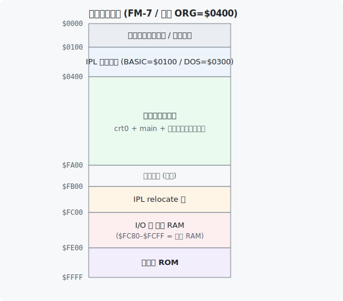

# DETAIL.md — 詳細解説

このドキュメントは [README.md](../README.md) (= 環境構築 + ビルド + 実行) の補足として、 内部の仕組みや起動シーケンス、 ハマりやすいポイントを詳しく説明します。

ゲームロジック (= `c_main.c`) の解説は [GAMEMAIN.md](GAMEMAIN.md)、 アセンブラ部分 (`*.s`) の概要は [GAMESUB.md](GAMESUB.md) を参照してください。

---

## 1. プロジェクト構成

```
FM7BaseCode/
├── config.mk                ← プロジェクト設定 (NAME / ORG。ここだけ触れば OK)
├── Makefile                 ← ビルドの入口 (config.mk を読む)
├── README.md                ← 環境構築 / ビルド / 実行
├── docs/                    ← ドキュメント一式 (DETAIL/GAMEMAIN/GAMESUB/… )
├── src/                       ← 人が書くソース (git track)。 命名規則は §3 参照
│   ├── asm_ipl.s            ← IPL (ブートセクタ、$FB00 トランポリン後 ORG=$0400 へ本体ロード)
│   ├── asm_crt0.s           ← 本体エントリ ($ORG) + CMOC runtime stub
│   ├── asm_subsys.s         ← サブシステムヘルパ (低レベル: HALT/RELEASE)
│   ├── asm_test.s           ← sub へコード/データ転送 + 実行 (TEST コマンド)
│   ├── asm_subprog.s        ← sub 上で動く独自描画プログラム
│   ├── asm_kbd.s            ← キーボード入力 (IRQ 駆動。 IRQ ハンドラが $FD01 を読みバッファ)
│   ├── asm_timer.s          ← フレームペーシング (メイン CPU の周期タイマ IRQ 約2ms を数える経過 tick)
│   ├── asm_runtime.s        ← CMOC runtime helper (MUL16 等)
│   ├── asm_bootrom.s        ← 自前ブート ROM (内蔵ブート ROM 代替、別ターゲット)
│   ├── c_main.c             ← C 側本体 (ゲームメインループ)
│   ├── c_subsys.c / .h      ← サブシステム ROM 経由 API (高レベル)
│   ├── c_subprog.c / .h     ← 自前 subprog + sprite + キー入力 C API
│   ├── c_sound.c / .h       ← PSG サウンド (発射音/歩行音/単音 BGM、 メイン側 I/O)
│   └── link.script          ← Makefile が config.mk の ORG から自動生成
├── scripts/                   ← 変換/ビルド用スクリプト (git track、 データと分離)
│   ├── make_font_png.py     ← TTF → assets/font.png
│   ├── font_to_asm.py       ← assets/font.png → assets/src/font_data.s
│   ├── sprite_to_asm.py     ← assets/character.png → assets/src/sprite_data.s (R/G 2 plane へ赤/シアン/白 ディザ量子化)
│   ├── bgtile_to_asm.py     ← assets/backimage.png → assets/src/bgtile_data.s (64x64 → B plane 512 byte)
│   ├── bin2asm.py           ← raw bin → C 配列 ASM (subprog 等)
│   ├── bin2d77.py           ← BIN → D77 変換
│   ├── d77_to_hfe.py        ← D77 → HFE (MFM) 変換
│   └── pad_bootrom.py       ← 自前ブート ROM を 512 byte 整形 + reset vector 埋込
├── assets/                    ← データ (= 入力素材) 専用。 スクリプトは置かない
│   ├── character.png        ← sprite 元画像 (前景、 git track)
│   ├── backimage.png        ← 背景タイル元画像 (64x64 モノクロ、 git track)
│   ├── font.png             ← 128×48 1-bit PNG (= make 自動生成、 gitignore)
│   └── src/                 ← asset 由来の生成 ASM (= 全部 gitignore)
│       ├── font_data.s      ← 8x8 bitmap font データ (= make 自動生成)
│       ├── sprite_data.s    ← 前景 sprite データ R/G 2 plane (= make 自動生成)
│       ├── bgtile_data.s    ← 背景タイル B plane 512 byte (= make 自動生成)
│       └── subprog_data.s   ← subprog バイナリの C 配列 (= make 自動生成)
├── tmp/                       ← 一時 DL/生成物 (gitignore)。 暫定スクリプトも実行時のみここに生成
│   └── Press_Start_2P/      ← TTF + OFL.txt (= make が curl で upstream から DL)
└── build/                   ← 生成物 (`make` で作られる、 gitignore)
```

### ディレクトリの役割分担

「人が書くもの」 「素材データ」 「それらを変換するスクリプト」 「生成物」 を分けています:

- **`src/`** — 人が書くソース (アセンブラ / C)。 git track。 命名規則は [§3](#3-各ソースファイルの役割)
- **`scripts/`** — 変換・ビルド用スクリプト (Python)。 **データとは別ディレクトリ**で git track するので、 素材を差し替えてもスクリプトは永続管理される
- **`assets/`** — データ (= 入力素材) 専用。 スクリプトは置かない。 `assets/src/` は素材から生成される ASM で gitignore
- **`tmp/`** — 実行時の一時 DL / 一時生成物 (gitignore)。 ビルド中にだけ必要な**暫定スクリプトを生成する場合もここ**に置く (= リポジトリには残さない)
- **`build/`** — `make` の最終生成物 (gitignore)

---

## 2. FM-7 系の起動シーケンス

D77 ディスクをドライブ 0 にセットして電源 ON した時に何が起きるかを把握しておきます。 機種によって 2 つの方式があります。

### 2.1 メモリ配置の全体像



```
$0000 ─┐  ダイレクトページ / システムゼロ page
$00FF ─┘
$0100 ─┐  BASIC モード時の IPL ロード域 (256 byte。 起動後は空き)
$01FF ─┘
$0300 ─┐  DOS モード時の IPL ロード域 (256 byte。 起動後は空き)
$03FF ─┘
$0400 ─┐  本体 (crt0 + main + サブシステムヘルパ) = ORG
       │     IPL が FDC を操作して sector を順次ここに展開
$F9FF ─┘     本体末尾 (ORG=$0400 なら最大 ~246 sector ロード時)
       │
$FA00 ─┐  空き領域 (= IPL relocate 先と本体の間のマージン 256 byte)
$FAFF ─┘
       │
$FB00 ─┐  IPL relocate 先 (= 自分自身のコピー)
$FBFF ─┘     bootstrap の最後で JMP $FB?? して本体読み込みを行う
       │     本体ロード完了 + JMP $0400 後は不要、 本体側 free
       │     (= ヒープ / スタックバッファ等として使ってよい)
       │
$FE00 ─┐  ブート ROM ($FE00-$FFFF, 512 byte)
$FFFF ─┘     FM-7 / FM77AV のブート ROM
```

### 2.2 機種別の起動経路

| 機種 / モード | boot ROM | IPL ロード先 | エントリ |
| --- | --- | --- | --- |
| FM-7 BASIC モード (標準) | BASIC モードのブート ROM | `$0100` | `JMP $0100` |
| FM-7 DOS モード | DOS モードのブート ROM | `$0300` | `JMP $0300` |
| FM77AV 互換モード | FM77AV の起動 ROM → BASIC/DOS ブート ROM 像を `$FE00` に展開して実行 | `$0100` / `$0300` | 同上 |
| FM77AV NEW BOOT (AV20+) | FM77AV の起動 ROM 内 新 boot | `$0100` | `JMP $0100` |

> **重要 — IPL ロード先は boot ROM 内の固定定数**: ロード先 (`$0100`/`$0300`) は
> 各ブート ROM 内のパラメータブロックの固定値で決まり、 ディスク側のマーカーでは
> ありません。
> **BASIC モード = `$0100`、 DOS モード = `$0300`** で、 IPL 入口は **DP=`$00` / SP=`$FC7F`**。
> FM77AV の起動 ROM は FM-7 の BASIC/DOS ブート ROM 像を `$FE00` に転送して実行するので、
> AV でも結局 FM-7 と同じ (`$0100`/`$0300`) になります。
>
> **FM-7 は通常 BASIC モード (BASIC モードのブート ROM) で起動**します (= 標準。 よほどのこと
> が無い限りこのモード)。 BASIC ブート ROM でも FDC は有効で、 起動可能ディスクが
> あれば先頭セクタ (IPL) を `$0100` に読み込んで実行 (= 無ければ F-BASIC 起動)。 つまり
> 標準構成の FM-7 にディスクを入れて電源 ON するだけで起動し、 DOS モード
> (DOS モードのブート ROM、 OS-9 等専用) は不要です。

本テンプレの [src/asm_ipl.s](../src/asm_ipl.s) は同一 `ipl.bin` が `$0100` でも `$0300` でも
ロードされ得るため、 bootstrap 部を `LEAX start,PCR` で「自分の今いる位置」 を取得して
`$FB00` へ relocate する位置非依存設計です (= 詳細は [GAMESUB.md](GAMESUB.md) §1 参照)。
本体 (ORG) は両ロード域 (`$0100-$01FF` / `$0300-$03FF`) を避けて **`$0400`** に置きます。

### 2.3 F-BASIC ROM overlay

`$FB00` は通常 F-BASIC ROM (= overlay ROM) で覆われていて、 そのままだと書き込めません。 IPL bootstrap の冒頭で `CLR $FD0F` (extended) を実行して overlay を OFF にしてから自己 relocate を開始します。 これで `$FB00` 領域が RAM として書き込み可能になります。

本体ロードアドレスは `$0400` (= config.mk ORG)、 スタックはブート ROM が設定した位置 (= 共有 RAM 直下の `$FC7F`、 DP=`$00`) をそのまま使います。

---

## 3. 各ソースファイルの役割

`src/` のソースは、 **ファイル名の接頭辞で言語が分かる命名規則**にしています:

- **`asm_*.s`** — 6809 アセンブラ (lwasm でアセンブル)。 拡張子 `.s`
- **`c_*.c` / `c_*.h`** — CMOC (6809 向け C コンパイラ) の C ソース / ヘッダ。 拡張子 `.c` / `.h`

`*` の部分は役割を表す任意名です (例: `asm_ipl.s`, `c_main.c`)。 Makefile は `src/*.s` を lwasm、 `src/*.c` を CMOC に回すので、 新規ファイルもこの規則に従えば自動的にビルド対象になります。

| ファイル | 役割 | 詳細 |
| --- | --- | --- |
| [config.mk](../config.mk) | プロジェクト設定 (NAME / ORG) | §4 参照 |
| [Makefile](../Makefile) | ビルドフロー | §5 参照 |
| [src/asm_ipl.s](../src/asm_ipl.s) | IPL (ブートセクタ) | [GAMESUB.md §1](GAMESUB.md#1-srcasm_ipls--ipl-ローダー--ブートセクタ) |
| [src/asm_crt0.s](../src/asm_crt0.s) | C エントリ + CMOC runtime stub | [GAMESUB.md §2](GAMESUB.md#2-srcasm_crt0s--c-本体エントリ--cmoc-ランタイム-stub) |
| [src/asm_subsys.s](../src/asm_subsys.s) | サブ CPU HALT/RELEASE | [GAMESUB.md §3](GAMESUB.md#3-srcasm_subsyss--サブ-cpu-haltrelease) |
| [src/asm_test.s](../src/asm_test.s) | TEST 発行 API (= sub プログラム転送 + 実行) | [SUBPROGRAM.md](SUBPROGRAM.md) |
| [src/asm_subprog.s](../src/asm_subprog.s) | sub 上で動く独自描画プログラム | [SUBPROGRAM.md §3](SUBPROGRAM.md#3-サブプログラム本体-asm_subprogs) |
| [src/asm_kbd.s](../src/asm_kbd.s) | キーボード入力 (IRQ 駆動。 IRQ ハンドラが `$FD01` を読みバッファ) | [SUBPROGRAM.md §8](SUBPROGRAM.md#8-キー入力-asm_kbds) |
| [src/asm_timer.s](../src/asm_timer.s) | フレームペーシング (timer_init/start/get + IRQ ハンドラ = メイン CPU の周期タイマ IRQ 約2ms を数える deadline) | [TIMER.md](TIMER.md) / [GAMEMAIN.md §2.7](GAMEMAIN.md#27-フレームレート安定化--フレームペーシング) |
| [src/asm_runtime.s](../src/asm_runtime.s) | MUL16 等の CMOC runtime helper | [GAMESUB.md §7](GAMESUB.md#7-srcasm_runtimes--cmoc-ランタイムヘルパ-mul16) |
| [src/asm_bootrom.s](../src/asm_bootrom.s) | 自前ブート ROM (任意) | [GAMESUB.md §8](GAMESUB.md#8-srcasm_bootroms--自前ブート-rom-任意) |
| [assets/src/font_data.s](../assets/src/font_data.s) | 8x8 bitmap font (生成物) | [FONT.md](FONT.md) |
| [assets/src/sprite_data.s](../assets/src/sprite_data.s) | 前景 sprite R/G 2 plane (生成物) | [SPRITE.md](SPRITE.md) |
| [assets/src/bgtile_data.s](../assets/src/bgtile_data.s) | 背景タイル B plane 512 byte (生成物) | §6 参照 |
| [assets/src/subprog_data.s](../assets/src/subprog_data.s) | subprog バイナリの C 配列化 (生成物) | [SUBPROGRAM.md §6](SUBPROGRAM.md#6-ビルドフロー) |
| [src/c_main.c](../src/c_main.c) | ゲームメインループ (sprite + キー入力) | [GAMEMAIN.md](GAMEMAIN.md) |
| [src/c_sound.c](../src/c_sound.c) / [.h](../src/c_sound.h) | PSG サウンド (発射音/歩行音/単音 BGM、 `$FD0D`/`$FD0E`) | [SOUND.md](SOUND.md) |
| [src/c_subsys.h](../src/c_subsys.h) | サブシステム (サブシステム ROM 経由) API ヘッダ | §6 参照 |
| [src/c_subsys.c](../src/c_subsys.c) | 同上の実装 | §6 参照 |
| [src/c_subprog.h](../src/c_subprog.h) | 自前 sub プログラム + sprite + キー入力 C API | [SUBPROGRAM.md §4](SUBPROGRAM.md#4-c-高レベル-api) |
| [src/c_subprog.c](../src/c_subprog.c) | 同上の実装 | 同上 |

---

## 4. config.mk — プロジェクト設定

普段書き換えるのはこのファイルだけで済むようになっています。

```make
NAME = hello
ORG  = 0x0400
```

| 変数 | 説明 |
| --- | --- |
| `NAME` | 生成される `build/<NAME>.bin` / `build/<NAME>.d77` のファイル名、 および D77 ディスクラベル |
| `ORG`  | 本体 main の開始アドレス。 Makefile が link スクリプトと IPL の `BODY_LOAD` 両方に自動反映する |

ORG を変えると Makefile が:
- `src/link.script` を再生成 (= 全セクションを ORG から連続配置)
- IPL のアセンブル時に `-D BODY_LOAD=$(ORG)` を渡して IPL の本体ロード先 + JMP を ORG に合わせる

を両方やるので、 ソース側を書き換える必要はありません。

---

## 5. Makefile の中で起きていること

### 5.1 ビルドフロー

```
src/*.c   --cmoc-->  build/*.s   --lwasm-->  build/*.o   --+
src/*.s   --lwasm-->  build/*.o                            +-- lwlink --> build/<NAME>.bin
                                                           |
src/link.script (= config.mk の ORG から自動生成) ---------+

build/<NAME>.bin  +  build/ipl.bin  --bin2d77.py-->  build/<NAME>.d77
                                                          |
                                       --d77_to_hfe.py--> build/<NAME>.hfe
```

### 5.2 各ステップの注意

- **CMOC**: `--intermediate --intdir=$(BUILD)` を渡して中間 `.s` / `.lst` を全部 `build/` に閉じ込めます。 ルートディレクトリは散らかりません。
- **lwlink + link.script**: CMOC が生成する `code` 以外のセクション (`rodata` / `start` / `initgl_*` 等) を全部 `$ORG` から連続配置するため。 これを省くと `JMP _main` などの cross-section 参照が `$ORG` オフセット抜きで解決されて本体が起動しません。
- **IPL アセンブル**: `lwasm -D BODY_LOAD=$(ORG)` で config.mk の ORG を渡しています。 `asm_ipl.s` 側は `ifndef BODY_LOAD` で fallback も持っているので、 手動で lwasm を直接呼ぶ時にも壊れません。
- **bin2d77.py**: IPL バイナリの +2 byte オフセットにある `body_sectors` を本体サイズから計算した値で書き換えてから、 D77 を組み立てます。
- **d77_to_hfe.py**: D77 を IBM System 34 互換の MFM トラックへエンコードして HFE (HxC Floppy Emulator) 形式を生成します。 HFE のフォーマットは[公式仕様が公開されています](https://hxc2001.com/floppy_drive_emulator/HFE-file-format.html)。

### 5.3 make ターゲット一覧

| コマンド | 動作 |
| --- | --- |
| `make`         | 3 種類の BIN (IPL / 本体 / 自前 boot ROM) と D77・HFE を全部作る |
| `make bin`     | 本体 BIN (`build/<NAME>.bin`) だけ作る |
| `make bootrom` | 自前ブート ROM (`build/bootrom.bin`) だけ作る (詳細は GAMESUB.md §5) |
| `make clean`   | `build/` をまるごと削除 |

生成物 3 種:

| パス | 役割 | サイズ |
| --- | --- | --- |
| `build/bootrom.bin` | 自前 bootstrapper (= 内蔵ブート ROM 代替、 `$FE00-$FFFF` 配置) | 512 byte |
| `build/ipl.bin` | IPL (= D77 sector 1 の中身、 `$0100`(BASIC)/`$0300`(DOS) で起動 → `$FB00` へ relocate) | < 256 byte |
| `build/<NAME>.bin` | プログラム本体 (= IPL が ORG=`$0400` に書き込む) | 任意 (最大 ~246 sector ≈ 61 KB) |

これらを束ねた `build/<NAME>.d77`、 およびそれを MFM 変換した `build/<NAME>.hfe` も同時に生成されます。

---

## 6. サブシステム呼び出しの内部仕様

FM-7 では VRAM がサブ CPU のアドレス空間にマップされており、 メイン CPU からは直接触れません。 描画はサブ CPU 側で動いている **サブシステム ROM** にコマンドを送って行います。

通信は共有 RAM (主側 `$FC80-$FCFF` = サブ側 `$D380-$D3FF`) を介します。 [src/c_subsys.h](../src/c_subsys.h) / [c_subsys.c](../src/c_subsys.c) がここを抽象化した `subsys_call()` を提供しています。

### 6.1 共有 RAM レイアウト

| 主 CPU | サブ CPU | 役割 |
| --- | --- | --- |
| `$FC80` | `$D380` | ERRREG: エラーコード (bit0-6) + Ready リクエスト (bit7) |
| `$FC81` | `$D381` | STATUS (ステータスレジスタ) |
| `$FC82` | `$D382` | **main→sub コマンドコード** (0=idle) |
| `$FC83` | `$D383` | パラメータ #0 (PRINT では 残文字数) |
| `$FC84-$FC8E` | `$D384-$D38E` | パラメータ #1 以降 (= 最大 11 byte) |

### 6.2 主な確認済コマンド

| CMD | 名称 | パラメータ |
| --- | --- | --- |
| `$01` `SCMD_INIT_SCREEN` | 画面モード初期化 | `$D384`=幅 (80 or 40), `$D385`=高 (25 or 20) |
| `$02` `SCMD_CLS` | 画面クリア | なし |
| `$03` `SCMD_PRINT` | **PRINT** (= 公式名 PUT、 内蔵 ANK font で描画) | `$D383`=N文字数, `$D384+`=ASCII バイト列 (= 最大 11、 共有 RAM サイズ由来の実装上限) |
| `$0C` `SCMD_CURSOR` | テキストモード/コンソール制御 (公式名 Console Control) | `$D383` 制御フラグ: bit0=cursor 表示 ON/OFF, bit3=スクロール, bit5=オート LF (自動改行) |

本テンプレの SCMD_* 名は機能に合わせた別名です (`$01`=画面初期化 / `$02`=クリア / `$03`=PRINT / `$0C`=コンソール制御)。

### 6.3 `subsys_call()` の実装フロー

FM-7 の仕様 (= 共有 RAM アクセスはサブ HALT 必須) と完了検出の注意点 (= 後述) を両方ケアした手順:

1. `subsys_halt()` (= サブ HALT 要求 + ACK 待ち)
2. `params` を `$D383+` に書く
3. `$D382 = cmd` で起動準備
4. `subsys_release()` (= サブ稼働再開 → サブが cmd を拾って処理)
5. 「サブが拾った」 サインを待つ: `[HALT → read $D382 → RELEASE]` を `$D382 == 0` になるまでループ
6. `SCMD_PRINT` の場合: `[HALT → read $D383 → RELEASE]` を `$D383 == 0` になるまでループ
7. ハンドラ末尾 cleanup の短 spin
8. `[HALT → read $D381 (STATUS) → RELEASE]` でステータスを取得して return (= エラーコードが必要なら `$D380`/ERRREG の bit0-6 を見る)

### 6.4 完了検出の罠 (重要)

サブシステム ROM は受付時に `$D382` を即クリアするため、 **`$D382 == 0` は「sub が拾った」 サインに過ぎず、 ハンドラ完了サインではありません**。 そこで本ヘルパは:

- **`SCMD_PRINT` (= cmd `$03` = 公式名 PUT)**: `$D383` を見る。 **本テンプレがエミュレータで観測した挙動**として、 sub が char を消費するごとに `$D383` が DEC され、 `$D383 == 0` が全文字描画完了のサインになる。 ※ これは公式仕様に明記された復帰情報ではなく観測ベースの実装依存判定 (PUT 節に復帰情報表は無い)。 確実を期すなら BUSY フラグ等の標準同期に寄せる手もある
- **その他のコマンド (CLS / CURSOR 等)**: `$D382 == 0` (= sub pickup) を待ったあと、 短 spin でサブのメインループ復帰を待つ

長時間ブロックする重いコマンドを足す場合は、 cmd 別の完了検出ロジックの追加が必要です。

### 6.5 描画モデル — 背景=B / 前景=R/G の plane 分担

サブシステム ROM の PRINT (テキスト) とは別に、 本テンプレはグラフィック描画用の **自前 subprog** をサブ CPU 上で動かします (= 詳細は [SUBPROGRAM.md](SUBPROGRAM.md))。 その描画モデルは plane を役割で分担しているのが特徴です。

FM-7 の VRAM は B / R / G の 3 plane (= 8 色) で構成されますが、 本テンプレはこれを **背景 = B plane 単体・前景 = R/G の 2 plane** という分担で使います:

- **背景**は B plane だけで描く (= モノクロのタイル絵)
- **前景** (sprite / 文字 / ボール) は R/G の 2 plane だけで描く

#### パレットによる色の二重化 (`$FD38-$FD3F`)

論理色番号 → 物理色の再割当を **パレット** で行います。 物理色の値は `G*4 + R*2 + B` (= デジタル GRB) です。 `palette_init()` が次のように設定します:

| 論理色 | 物理色 (GRB) | 意味 |
| --- | --- | --- |
| 0 | `$00` 黒 | 背景の暗部 |
| 1 | `$01` 青 | 背景の明部 (B plane = 1) |
| 2 | `$02` 赤 | 前景 赤 |
| 3 | `$02` 赤 | 前景 赤 (二重化) |
| 4 | `$05` シアン | 前景 シアン |
| 5 | `$05` シアン | 前景 シアン (二重化) |
| 6 | `$07` 白 | 前景 白 |
| 7 | `$07` 白 | 前景 白 (二重化) |

論理色番号は `B + R*2 + G*4` のビット構成なので、 **2/3=赤・4/5=シアン・6/7=白** と隣り合うペアを同じ物理色に二重化しておくと、 **前景は R/G だけ立てれば B (背景) の 0/1 に関わらず前景色が確定**します。 さらに R=G=0 のドットは論理色 0 (B=0) / 1 (B=1) = 背景色そのものになるので、 **前景の透明部はマスク処理なしで自動的に背景が透ける**仕組みです。

#### 前景 color コード

自前 subprog に渡す前景の color コードは **bit0=R, bit1=G** の 2 bit です:

| color | R | G | 見える色 |
| --- | --- | --- | --- |
| 0 | 0 | 0 | 透明 (背景が残る) |
| 1 | 1 | 0 | 赤 |
| 2 | 0 | 1 | シアン |
| 3 | 1 | 1 | 白 |

#### 背景タイル (backimage.png)

背景は単色塗りではなく、 **64x64 のモノクロ画像 `assets/backimage.png` を全画面にタイル敷き**します。 [scripts/bgtile_to_asm.py](../scripts/bgtile_to_asm.py) が 64x64 を **B plane 用 512 byte** (= 64 line × 8 byte) に変換します (明 = B1 = 論理色 1 = 青、 暗 = B0 = 黒)。

サブ側の `DRAW_BG` (`$07`) コマンドは「R/G plane を全クリア + B plane に 64x64 タイルを全画面 (200 line × 80 byte) へ敷く」処理です。 横は 64px (8 byte) 周期、 縦は 64 line 周期で繰り返します。

C 側では起動時に `sub_load_bgtile()` でタイルデータをサブの `$CB00` へ転送してから (= `sub_draw_bg` の前に呼ぶ)、 `sub_draw_bg()` で全画面に敷きます。 タイルデータは `extern const unsigned char bgtile_data[]` (512 byte) として参照します。

#### 前景 sprite データ形式

1 sprite は **R plane (128 byte) + G plane (128 byte) = 256 byte** です。 16 sprite で 4096 byte になります。 [scripts/sprite_to_asm.py](../scripts/sprite_to_asm.py) は `assets/character.png` を **Floyd-Steinberg ディザで 赤 / シアン / 白 の 3 色へ量子化**し、 R/G の 2 plane に出力します。 横に隣接するドットの混色 (赤シアン / 赤白 / シアン白) で 6 色相当に見せる狙いです。

描画 (`BLIT_SPRITE` `$04`) は R/G plane への単純な上書き (store) で行います。 透明 (src_R=src_G=0) のドットは R/G に 0 が入りますが、 背景は B plane に分離してあり (= R/G とは独立) 触らないので、 そこは B = 青が透けます。 セルを毎回置換するので前の絵の残像も自動で消え、 OR/RMW は不要です。 消去は R/G を 0 クリアするだけで済みます (= 背景タイルは B plane に残るので、 背景の塗り直しや退避バッファは不要)。

#### サブ側メモリ配置

自前 subprog が使うサブ CPU 側のメモリ配置は次の通りです:

| 番地 | 用途 |
| --- | --- |
| `$C200-$C2FF` | subprog 作業変数 |
| `$C300-$C6FF` | subprog コード |
| `$C700-$CAFF` | sprite (現在方向 4 frame × 256 byte) |
| `$CB00-$CCFF` | 背景タイル (512 byte) |
| `$D000-` | サブシステム作業域 (= 触らない) |

#### サブ コマンド一覧

自前 subprog が受け付けるコマンドは次の通りです (= いずれも前景は R/G 2 plane への操作):

| CMD | 名称 | 動作 |
| --- | --- | --- |
| `$00` | NOP | 何もしない |
| `$01` | PUT_CELL | R/G 単色セル描画 |
| `$02` | CLR_CELL | R/G クリア |
| `$03` | CLS | 画面クリア |
| `$04` | BLIT_SPRITE | R/G plane への上書き (store) で sprite 描画 |
| `$05` | ERASE_BOX | 矩形を R/G クリア |
| `$06` | MOVE_SPRITE | sprite 移動 |
| `$07` | DRAW_BG | 背景タイル敷き (R/G 全クリア + B にタイル) |
| `$08` | DRAW_CHAR | R/G で文字描画 |
| `$09` | DRAW_BALL | R/G でボール描画 |
| `$0A` | ERASE_BALL | ボールを R/G クリア |

> サブの `$D430` VSync 待ちは FM-7 では無効なので、 `MOVE_SPRITE` では VSync 待ちをしません。 フレーム周期は main 側が経過 tick (= メイン CPU の周期タイマ IRQ 約2ms を数える) の deadline 方式で揃えます ([TIMER.md](TIMER.md))。

---

## 7. 動作確認時に当たりやすいポイント

### 7.1 エミュレータによる挙動差

本テンプレは下記 2 点で FM-7 本来の挙動を前提にしています。 エミュレータによってはこの制約が再現されず素通りで動くことがあり、 別のエミュレータでは正しく動かない、 ということが起こり得ます。 複数のエミュレータで確認しておくと安心です。

- **共有 RAM (`$FC80-$FCFF`) アクセスはサブ HALT 必須** (= §6.3 参照)
- **MB8877 FDC は CMD 書込後 ~14μs で BUSY=1** (= [GAMESUB.md §1](GAMESUB.md#1-srcasm_ipls--ipl-ローダー--ブートセクタ) 参照)

### 7.2 起動経路の機種差

- 本テンプレの IPL は `LEAX start,PCR` ベースで `$0100` (BASIC) / `$0300` (DOS) どちらのロード先でも動く (= §2.2 参照)。 ロード先を決め打ちした絶対参照を入れると片方のモードで動かなくなる

### 7.3 FDC のリトライ

本サンプルは BUSY/DRQ をポーリングするだけの素朴な実装。 FM-7 ではタイミングが厳しく、 リトライや NMI 経由のハンドリングが必要になる場合があります。

### 7.4 サイド／ドライブ選択ポートのビット定義

`$FD1D` のビット割り当ては機種・カードによって違うことがあります。 必要に応じてサービスマニュアル相当の資料で確認してください。

### 7.5 サブシステム完了検出

本ヘルパは `SCMD_PRINT` だけ `$D383` ポーリングで完了判定し、 他コマンドは短 spin で済ませています (§6.4 参照)。 重い cmd を足す場合は cmd 別の完了検出ロジックの追加が必要です。

### 7.6 CMOC の呼び出し規約

本サンプルは「引数はスタック、 `char` も 16bit 単位で push、 16-bit 戻り値は `D` (= `A`:`B` ペア。 `A` が上位、 `B` が下位)、 関数名先頭にアンダースコア」を前提にしています (8-bit 戻り値は `B`)。 CMOC のバージョンや最適化オプションで差異が出ることがあるので、 `--intermediate` で生成された `build/<name>.s` を読んで引数オフセットが想定と合っているかを確認するのが確実です。

---

## 8. ディスクイメージの中身

`make` で生成される D77 (= `build/<NAME>.d77`) は 2D / 40 トラック × 2 サイド × 16 セクタ × 256 バイト構成で、 起動に必要なデータは disk 先頭から **side-major** で連続配置されます。 最大 **248 sector (= 62 KB)** = track 0/1 〜 track 7 の一部までを使用します。

```
sector 1 (track 0/side 0)         : IPL              (256 byte)
sector 2..16 (track 0/side 0)     : 本体 BIN sec  0..14   (15 sector)
sector 1..16 (track 0/side 1)     : 本体 BIN sec 15..30   (16 sector、 SEEK 不要)
sector 1..16 (track 1/side 0)     : 本体 BIN sec 31..46   (16 sector、 SEEK 必要)
sector 1..16 (track 1/side 1)     : 本体 BIN sec 47..62   (16 sector、 SEEK 不要)
...
sector 1..9  (track 7/side 1)     : 本体 BIN sec 240..248 (最大時)
```

### 配置式

```
flat  = body_idx + 1            ; IPL が flat=0 を占めるので +1
track = flat / 32               ; 1 トラック = 16 sec × 2 side = 32 sec
side  = (flat / 16) % 2         ; side 0 を先に埋めて side 1 へ
sec   = (flat % 16) + 1         ; 物理 sector 番号 (1-origin)
```

[scripts/bin2d77.py](../scripts/bin2d77.py) と [src/asm_ipl.s](../src/asm_ipl.s) はこの式を共有しており、 D77 配置と IPL の read 順が一致するようになっています。

### body_sectors 値の管理

本体 BIN のセクタ数を `body_sectors` (1 byte、 最大 255) として IPL バイナリ先頭 +2 オフセットに埋め込みます。 これは `bin2d77.py` が `D77` を組み立てる時に本体サイズから自動計算して書き込み、 IPL 側は起動時にこの値を読んで「何セクタ読めばいいか」 を知ります。

本体サイズの上限は **`($FA00 - ORG) / 256` sector** です (= IPL relocate 先 `$FB00` の手前 `$FA00` マージンまで)。 既定 ORG=`$0400` なら **246 sector (≈ 61 KB)**。 [scripts/bin2d77.py](../scripts/bin2d77.py) が config.mk の ORG (= Makefile が `--org` で渡す) からこの上限を計算し、 超過時はビルドをエラーにします。 これ以上を扱う場合は IPL の relocate 戦略から見直しが必要です。

### IPL 側の読み込みロジック

IPL は起動時に次の流れで本体を `$0400` (= ORG) 以降に展開します:

1. 初期状態: `cur_track=0, cur_side=0, cur_sec=2`、 `B = body_sectors`
2. 1 セクタ読込: FDC `READ` (`$80`) を発行、 BUSY=1 待ち → DRQ ループで `,X+` に展開
3. `B--`、 0 なら main へジャンプ
4. `cur_sec++`、 16 を超えたら side を反転 (`$FD1C` bit0 toggle)
5. side が 1→0 に wrap したら `cur_track++` して FDC `SEEK` (`$1B`) で head 移動
6. ステップ 2 に戻る

詳細な実装は [src/asm_ipl.s](../src/asm_ipl.s) と [GAMESUB.md §1](GAMESUB.md#1-srcasm_ipls--ipl-ローダー--ブートセクタ) を参照。

### コマンドライン

[Makefile](../Makefile) から次の形で呼ばれます:

```bash
python3 scripts/bin2d77.py \
    --ipl build/ipl.bin \
    --body build/hello.bin \
    --name hello \
    -o build/hello.d77
```

詳細は [scripts/bin2d77.py](../scripts/bin2d77.py) を参照。

---

## 9. 関連ドキュメント

- [README.md](../README.md) — 環境構築 / ビルド / 実行
- [GAMEMAIN.md](GAMEMAIN.md) — `c_main.c` のゲームロジック解説
- [GAMESUB.md](GAMESUB.md) — アセンブラ部分の概要
