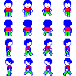
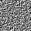

# SPRITE.md — 32x32 sprite データ形式と変換パイプライン

FM-7 の VRAM は **B/R/G の 3 plane** で物理 8 色を表現しますが、 本テンプレでは描画モデルを分担制に変えています。 **背景は B plane 単体**、 **前景 (sprite) は R/G の 2 plane** だけを使います。 B (背景) と R/G (前景) を別 plane に分けることで、 前景は R/G を立てるだけで描け、 B (背景) を壊さずに済みます。

色は **パレット (`$FD38-$FD3F`)** で論理色番号 → 物理色を再割当して作ります (値 = G\*4 + R\*2 + B = デジタル GRB)。 `palette_init()` は次のように設定します: 色0=黒(`$00`) / 色1=青(`$01`,背景) / 色2=赤(`$02`) / 色3=赤(`$02`) / 色4=シアン(`$05`) / 色5=シアン(`$05`) / 色6=白(`$07`) / 色7=白(`$07`)。 2/3=赤・4/5=シアン・6/7=白 と **二重化**してあるのが要点で、 こうすると前景は R/G だけ立てれば B (背景) の有無に関わらず前景色が決まり、 **R=G=0 が自動的に背景透過**になります (= ハードの透過機能の代わり)。

このため雛形の sprite データは VRAM 用の **R/G 2 plane** だけ (= 32x32 pixel) を持ちます。 透過は専用の mask 面を持たず、 **R/G plane への単純な上書き (store)** と **背景の B plane 分離** で実現します (= `R=G=0` の pixel は R/G に 0 が入るが、 別 plane の B 背景が透ける)。 描画はサブプログラムの `BLIT_SPRITE` / `MOVE_SPRITE` cmd が行います。 ここでは sprite 1 個のデータ構造と、 PNG からの変換ルールをまとめます。

全 16 sprite (= 4 方向 × 4 歩行 frame) を main rodata に持ち、 sub には「現在向いている方向の 4 frame」 だけを動的ロードして使います (= console RAM に 16 sprite を常駐できないため)。

## 1. 入力 PNG ([assets/character.png](../assets/character.png))

実際に使用しているスプライト元画像 (128×128、 4×4 = 16 sprite):



| 項目 | 値 |
|---|---|
| サイズ | 128 × 128 pixel |
| モード | RGBA (8-bit / channel) |
| レイアウト | 4 行 × 4 列 = 16 sprite grid |
| 各 sprite | 32 × 32 pixel |
| 行 (= direction) | 0:DOWN  1:UP  2:RIGHT  3:LEFT |
| 列 (= anim frame) | 0..3 |

雛形では各方向の **frame 1 (= 列 0) のみ** を使用 (= 4 sprite)。 アニメーションは別途実装。

## 2. 出力 ASM ([assets/src/sprite_data.s](../assets/src/sprite_data.s) — 生成物)

```
section rodata
export _sprite_data
export _sprite_data_len

_sprite_data:
  ; sprite 0 (DOWN, frame 1) = dir 0 frame 0
  ; R plane (128) / G plane (128)
  fcb ...
  ; sprite 1 (DOWN, frame 2) = dir 0 frame 1
  ...
  ; ... dir 0 frame 2,3、 dir 1 (UP) frame 0..3、 dir 2 (RIGHT) ...、 dir 3 (LEFT) ...

_sprite_data_len: fdb 4096
```

並びは dir-major: `sprite_data[(dir * 4 + frame) * 256 ..]`。

C 側から:

```c
extern const unsigned char sprite_data[];
extern const unsigned int  sprite_data_len;   /* = 4096 (= 16 sprite × 256) */
```

## 3. 1 sprite のレイアウト

```
1 sprite = 256 byte
┌──────────────────────────────┐
│ R plane bitmap    128 byte    │  ← R 成分が立ってる pixel = 1
├──────────────────────────────┤
│ G plane bitmap    128 byte    │  ← G 成分が立ってる pixel = 1
└──────────────────────────────┘
```

前景 color コードは **bit0=R, bit1=G** で、 `0=透明 / 1=赤 / 2=シアン / 3=白` を表します (= パレット二重化により R/G の組み合わせがそのまま赤/シアン/白に見える)。 mask 面は持たず、 透過は「R=G=0 を R/G にそのまま store する → 別 plane の B 背景が透ける」 ことで成立します。

各 plane: **32 line × 4 byte/line = 128 byte**

```
1 line (= 4 byte = 32 px):
┌────┬────┬────┬────┐
│ R0 │ R1 │ R2 │ R3 │
└────┴────┴────┴────┘
  ↑ MSB が左 px
```

例: `R0 = $80` なら、 その plane の left-most pixel が ON、 残り 7 px が OFF。

## 4. 色の決定ルール ([sprite_to_asm.py](../scripts/sprite_to_asm.py))

`sprite_to_asm.py` は `character.png` を **Floyd-Steinberg ディザで 赤/シアン/白 の 3 色へ量子化**し、 各 pixel を R/G 2 plane へ落とします。 前景 color は `bit0=R, bit1=G` なので、 赤=`R` のみ / シアン=`G` のみ / 白=`R+G` の 3 状態に対応します (透明は R=G=0)。

```python
if alpha < 128:
    # 透明: R/G とも 0 (= 描画時に R/G へ 0 が store され、 別 plane の B 背景が透ける)
    continue
# 不透明: 赤/シアン/白 のどれかへ量子化 (Floyd-Steinberg ディザ)
# 赤  -> R=1, G=0
# シアン -> R=0, G=1
# 白  -> R=1, G=1
if want_R: byte_r |= bit          # R plane
if want_G: byte_g |= bit          # G plane
```

- **mask は持たず plane 分離で背景保持**: 描画は `VRAM_R = src_R` / `VRAM_G = src_G` の単純な上書き (store) です。 透明部分 (R=G=0) は R/G に 0 が入りますが、 背景は B plane (= R/G とは独立) に分離してあり描画で触らないので、 そこは B plane の青がそのまま透けます。
- **赤/シアン/白 の 3 色 + 横ディザで 6 色相当**: 前景は R/G の組み合わせで 赤/シアン/白 の 3 色。 横に隣接するドットを別色にして混色させる (赤シアン/赤白/シアン白) ことで、 見かけ上 6 色相当の表現になります。 PNG の中間色は Floyd-Steinberg ディザでこの 3 色へ振り分けられます。

## 5. sub 上の配置先 (= 現在方向の 4 frame だけ常駐)

| アドレス | 内容 |
|---|---|
| `$C700-$C7FF` | 現在方向 frame 0 — 256 byte (R 128 / G 128) |
| `$C800-$C8FF` | 現在方向 frame 1 |
| `$C900-$C9FF` | 現在方向 frame 2 |
| `$CA00-$CAFF` | 現在方向 frame 3 |

合計 1024 byte = 4 frame × 256 byte (`$C700-$CAFF`)。 方向が変わると `sub_load_dir_frames(dir)` でこの 4 frame を入れ替える。 sub からはこの 4 frame が常に sprite_id 0..3 として見える。 直後の **`$CB00-$CCFF` は背景タイル (512 byte)** が使う ([§7](#7-背景タイルと-sprite-の消去) 参照)。

sub のメモリ配置は次の通り (新): `$C200-$C2FF` subprog 作業変数 / `$C300-$C6FF` subprog コード / `$C700-$CAFF` sprite (現在方向 4 frame × 256) / `$CB00-$CCFF` 背景タイル (512) / `$D000-` サブシステム作業域 (触らない)。

### sprite データ base の制約

sprite データの base は subprog コード末尾より十分後ろに置きます (= subprog がコード領域を侵食すると、 sprite データを命令として実行して暴走する)。 現状は **`$C700`** です。 機能追加で subprog コードは伸びるので、 `make` 後に `subprog.bin` のサイズ (= `$C300 + size`) が SPRITE_BASE を超えてないか確認すること。 SPRITE_BASE (`asm_subprog.s`) と SUB_CHARS_ADDR (`c_subprog.h`) の 2 箇所は常に一致させます。

## 6. 描画 (= `sub_blit_sprite` / `sub_move_sprite`、 R/G への上書き store)

`asm_subprog.s` の描画は **R/G の 2 plane への単純な上書き (store)** です。 mask は持たず、 各 pixel byte を sprite データでそのまま置換します:

```
VRAM_R = sprite_R          ; R plane をそのまま上書き
VRAM_G = sprite_G          ; G plane をそのまま上書き
```

透明 pixel (R=G=0) は R/G に 0 が入りますが、 背景は **B plane に分離** してあり (= R/G とは独立) この描画で触らないので、 そこは B plane の青がそのまま透けます。 セル全体を毎回置換するので前の絵 (= 残像) も自動で消え、 OR/RMW や別途クリアは不要です。 sprite layout は `[R][G]` で 128 byte 離れているので、 1 byte 処理の中で `128,y` の offset アクセスで G を読みます。 B plane には触れないので背景は破壊されません。

> なお前景どうし (sprite・文字・ボールはいずれも R/G) が重なる場合、 上書き (store) なので後から描いたものが下の前景の R/G を 0 で潰します (背景 B は別 plane なので無事)。 単一キャラ前提の雛形では許容しています。

## 7. 背景タイルと sprite の消去

実際に使用している背景タイル元画像 (64×64 モノクロ):



背景は単色塗りではなく **64x64 モノクロ画像 `backimage.png` をタイル敷き**にします。 `scripts/bgtile_to_asm.py` が 64x64 を **B plane 512 byte (64 line × 8 byte)** に変換します (明 = B1 = 色番号 1 = 青、 暗 = B0 = 黒)。 sub 側の `DRAW_BG` (`$07`) は「R/G plane を全クリア + B plane に 64x64 タイルを全画面 (200 line × 80 byte) に敷く」 処理で、 横 64px (8 byte) 周期・縦 64 line 周期でタイルを繰り返します。

C API は `sub_load_bgtile()` で起動時にタイルを sub の `$CB00` へ転送します (`sub_draw_bg` の前に呼ぶ)。 タイルデータは `extern const unsigned char bgtile_data[]` (512 byte) として参照します。

sprite を消すときは **R/G plane を 0 クリアするだけ** です (`sub_erase_box` / 移動時の旧位置)。 R/G を 0 にすると前景が消え、 触れていない B plane の背景 (= 青の背景) がそのまま残ります。 背景の再生成も退避バッファも不要で、 残像も出ません。 これは B (背景) と R/G (前景) を別 plane に分けた分担制の利点です。

## 8. ビルドフロー

```
assets/character.png  ──┐
                        │  python3 scripts/sprite_to_asm.py
                        ▼
              assets/src/sprite_data.s  ──┐
                                          │  lwasm --obj
                                          ▼
                               build/sprite_data.o  ──┐
                                                      │  lwlink
                                                      ▼
                                            本体 BIN に埋め込み
                                            (= rodata section)
```

`Makefile` の関連ルール:

```makefile
SPRITE_PNG      = ./assets/character.png
SPRITE_DATA     = $(ASSETS_SRC)/sprite_data.s
SPRITE_TO_ASM   = ./scripts/sprite_to_asm.py

$(SPRITE_DATA): $(SPRITE_PNG) $(SPRITE_TO_ASM)
	@mkdir -p $(dir $@)
	python3 $(SPRITE_TO_ASM) $(SPRITE_PNG) $@
```

PNG を更新したり、 sprite_to_asm.py のロジックを変えたりすると、 次の `make` で sprite_data.s が自動再生成されます。

## 9. 将来拡張のヒント

歩行アニメ (= 16 sprite の動的ロード)、 R/G の上書き (store) + B plane 分離による透過、 背景タイル敷きは **すでに実装済み**です (= 歩行アニメは §5、 透過は §3-§4・§6、 背景タイルは §7)。 ここからさらに広げるなら:

- **異なる sprite サイズ**: 16x16 や 24x24 にしたければ `scripts/sprite_to_asm.py` の `SPRITE_PX` と `asm_subprog.s` の `SPRITE_H_LINES` / `SPRITE_W_BYTES` を揃えて変更。
- **同時に出す sprite を増やす**: 4 方向ぶん (= 16 sprite) を超えて敵キャラ等も常駐させたい場合は、 sub 上の sprite データ領域 (`$C700-$CAFF`) と背景タイル (`$CB00-$CCFF`)、 subprog コードの配置を再計算する (= sub I/O 領域 `$D000` の手前まで)。
- **背景タイルを差し替える**: `assets/backimage.png` (64x64 モノクロ) を描き換えると、 次の `make` で `bgtile_data` が再生成されてタイル柄が変わる。

## 10. 関連ドキュメント

- [SUBPROGRAM.md](SUBPROGRAM.md) — sprite 描画の仕組み全体 (= TEST 機構 + sub 側プログラム)
- [GAMEMAIN.md](GAMEMAIN.md) — sprite を使ったゲームロジック (= c_main.c)
- [DETAIL.md](DETAIL.md) — プロジェクト全体の構造
