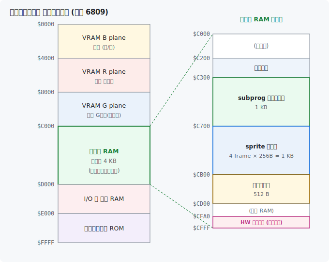

# SUBPROGRAM.md — 自前サブプログラムによる独自描画

サブ CPU 上で動く サブシステム ROM の標準描画コマンド (PRINT / BOX / LINE 等) は character cell unit (= 8×8 pixel) でしか描けず、 32x32 sprite を pixel 単位の自由位置に描こうとすると遅すぎたり位置制限が出たりします。 そこで本テンプレでは **自前のサブ描画プログラムをサブ CPU の RAM に転送 + 実行する** 仕組みを用意し、 byte 単位 / line 単位の自由な VRAM 直書きができるようにしています。

仕組みの中核は サブシステム ROM の **「TEST コマンド」 (= 拡張コマンド)**。 これを使って main から sub の任意 RAM 番地にコード / データを転送して呼び出します。

要素は 5 つ:

1. **main 側 TEST 発行 API** — [src/asm_test.s](../src/asm_test.s) + [src/c_subprog.h](../src/c_subprog.h)
2. **サブ側で動く独自プログラム** — [src/asm_subprog.s](../src/asm_subprog.s)
3. **sprite データの sub への転送 (= 32x32 pixel bitmap、 前景 R/G 2 plane)** — [scripts/sprite_to_asm.py](../scripts/sprite_to_asm.py)
4. **C 高レベル API** — [src/c_subprog.c](../src/c_subprog.c)
5. **キーボード入力 (= IRQ 駆動。 IRQ ハンドラが `$FD01` を読みバッファ)** — [src/asm_kbd.s](../src/asm_kbd.s)

### 描画モデル: 背景 B plane 単体・前景 R/G 2 plane

本テンプレは FM-7 の B/R/G 3 plane (8 色) を、 **背景 = B plane 単体・前景 = R/G 2 plane** に役割分担します。 さらに **パレット (`$FD38-$FD3F`)** で論理色番号→物理色を再割当 (値 = `G*4 + R*2 + B` のデジタル GRB) し、 前景は R/G の 2 bit だけで色が決まるようにします。 `palette_init()` の設定:

| 論理色 | パレット値 | 物理色 | 用途 |
|---|---|---|---|
| 0 | `$00` | 黒 | 背景の暗部 |
| 1 | `$01` | 青 | 背景の明部 |
| 2 | `$02` | 赤 | 前景 (R) |
| 3 | `$02` | 赤 | 前景 (R)、 二重化 |
| 4 | `$05` | シアン | 前景 (G) |
| 5 | `$05` | シアン | 前景 (G)、 二重化 |
| 6 | `$07` | 白 | 前景 (R+G) |
| 7 | `$07` | 白 | 前景 (R+G)、 二重化 |

2/3=赤・4/5=シアン・6/7=白 と **2 つずつ二重化**しているのが要点です。 こうすると前景色は R/G の 2 bit だけで決まり、 **B (= 背景) が 0 でも 1 でも前景色は同じ**になります。 結果として前景は R/G だけ立てればよく、 `R=G=0` の場所は自動的に背景 (B) がそのまま見える = **透過マスクが不要**になります。

**前景 color コード**は **bit0=R, bit1=G** の 2 bit:

| color | R | G | 見える色 |
|---|---|---|---|
| 0 | 0 | 0 | 透明 (背景を残す) |
| 1 | 1 | 0 | 赤 |
| 2 | 0 | 1 | シアン |
| 3 | 1 | 1 | 白 |

雛形の動作概要は「テンキー 8/2/4/6 で 32x32 character を上下左右に動かす」 ことで、 これらすべての要素が組み合わさった demo になっています。

---

## 1. TEST コマンドとは

> 俗に「YAMAUCHI コマンド」 とも呼ばれますが、 本サンプルでは以下 **TEST コマンド** (= サブシステム ROM の **CMD `$3F`**) と呼びます。

サブシステム ROM の 拡張コマンド領域の **CMD `$3F`** にある拡張 (TEST/DEBUG) コマンド。 共有 RAM に特定フォーマットの「サブコマンド列」 を書いて発火すると、 sub の workspace 上で memory copy や任意番地 JSR を実行してくれます。

### 共有 RAM レイアウト (main 側アドレス)

| アドレス | 内容 |
|---|---|
| `$FC80` | `$00` (= 未使用) |
| `$FC81` | `$00` (= 未使用) |
| `$FC82` | **`$3F` = TEST コマンド** |
| `$FC83-$FC8A` | 8 byte キーワード (= FM-7 では照合しないが配置必須) |
| `$FC8B` | サブコマンド: `$91=MOVE` / `$93=CALL` / `$90=END` |
| `$FC8C+` | サブコマンドのパラメータ |

### サブコマンド一覧

| code | 名前 | パラメータ | 動作 |
|---|---|---|---|
| `$90` | END | なし | サブコマンド列の終端 |
| `$91` | MOVE | src (2B) + dst (2B) + len (2B) | sub 空間内で memory copy |
| `$93` | CALL | addr (2B) | sub 上の addr に JSR (RTS で帰る) |

サブコマンドは END まで連続して書けます。 **末尾には必ず END (`$90`) を置くこと** — END を忘れるとサブシステムが列の終端を認識できず、 後続のメモリをサブコマンドとして解釈し続けて**異常終了・暴走**します。 本テンプレの `sub_takeover` は実装簡略化のため「MOVE 発火」 と「最後の CALL 発火」 を別 TEST 発火に分けています。

### HALT プロトコル (重要)

TEST cmd を発火する前後で以下の手順を踏みます (= 省略すると不安定):

1. **HALT request**: `$FD05` に `$80` を書く (= sub に HALT 要求)
2. **wait BUSY**: `$FD05` bit7 = 1 を待つ (= HALT 受領を確認) ← **省略不可**
3. 共有 RAM (`$FC80-`) に TEST cmd を書く
4. **RELEASE**: `$FD05` に `$00` を書く → sub が cmd 実行開始
5. (必要なら) **wait READY**: 完了を待つ

### `wait_ready` の意味

`wait_ready` は `$FD05` bit7 = 0 を待つだけで、 これは **「sub が動いている (= HALT/BUSY じゃない) 状態に入った」 ことの確認** であって **「cmd handler の処理が完了した」 ことの保証ではありません**。 具体的には:

- FM-7 仕様: `(_subHalted || _subBusy) ? $FE : $7E` — 動いてる時 = `$7E` (bit7=0) で wait_ready 即抜け
- `wait_ready` を「cmd 完了」 と勘違いすると、 sub が cmd 実行中なのに main が次へ進んで race する

本テンプレでは cmd の完了は **「sub program が末尾で `clr CMD_REG` する」** ことで間接的に伝え、 主要な race 経路 (= subsys_call → subprog_init) は delay で吸収する戦略を取っています。

### sub_halt 再要求の race

`sub_release` 直後にもう一度 `sub_halt` を要求するケースで、 環境によっては `_subBusy=true` 残留により `$FD05` bit7 = 1 のまま長く居続け、 `wait_ready` が永久 hang することがあります。 対策として:

- **`_sub_halt` / `_sub_call` 冒頭の `wait_ready` を削除** (= HALT 要求は冪等、 wait_busy だけ残す)
- main 側 caller が `sub_release` 直後に `sub_halt` する設計は避ける (= `sub_call` の中で halt から始めるので、 高レベル API で release を呼ばなくて済む)

---

## 2. main 側 API ([src/asm_test.s](../src/asm_test.s))

```c
void sub_wait_ready(void);          /* $FD05 bit7 = 0 まで待つ */
void sub_halt(void);                /* HALT 要求 → BUSY=1 受領待ち */
void sub_release(void);             /* HALT 解除 */
void sub_call(unsigned addr);       /* sub の addr に JSR (= TEST CALL) */
void sub_takeover(const void *code, unsigned len,
                  unsigned dst, unsigned exec);
```

### `sub_call(addr)`

TEST CALL cmd を組み立てて発火するだけの薄い wrapper。 内部で `sub_halt → build_header → release → wait_ready` の流れ。

### `sub_takeover(code, len, dst, exec)`

main RAM 上の `code` (= len バイト) を sub の `dst` 番地に転送し、 完了後に `sub_call(exec)` で実行開始する高レベル API。 共有 RAM の後半 `$FCA0-$FCDF` (= 64 byte) を chunk バッファとして使い、 **64 byte ずつ分割転送** します。

`exec = 0` を渡すと最後の CALL を skip して「転送のみ」 として動作 (= sprite データ等の純粋データ転送用)。

```c
extern const unsigned char subprog_bin[];
extern const unsigned int  subprog_len;
extern const unsigned char sprite_data[];
extern const unsigned int  sprite_data_len;

/* subprog (= 実行コード) を $C300 に転送 + 起動 (NOP) */
sub_takeover(subprog_bin, subprog_len, 0xC300, 0xC300);

/* sprite データ (= 純粋データ) を $C700 に転送 (exec=0 で CALL skip) */
sub_takeover(sprite_data, sprite_data_len, 0xC700, 0);
```

#### 実装上の注意点

1. **スタックオフセット計算**: `pshs u,y` (+4) + `leas -5,s` (+5) の合計 +9 のシフトを引数アクセス時に必ず加算する。 これを忘れると `code` ポインタを `len` として使用する等で sub workspace 暴走 → 二次的に main hang。
2. **`clra` で HI byte 消失**: `ldd / addb / adca #0 / std` の素朴な 16-bit 加算で書くこと。 途中で `clra` すると 16-bit 値の HI byte を消す。
3. **初回 chunk の race**: 直前に `subsys_call` を呼んでいると sub がまだ CLS 等を実行中で、 sub_takeover の初回 sub_halt が「BUSY=1 立ってる = halt 完了」 と誤判定 → 共有 RAM への write が反映されない (= FM-7 の仕様) → 初回 chunk のみ転送失敗。 対策として **subsys_call の後に十分な delay を挟む** (= `c_main.c` の `delay_loop(500)`)。

---

## 3. サブプログラム本体 ([asm_subprog.s](../src/asm_subprog.s))

サブ CPU 上で実行されるコード。 配置先は `$C300`。 1 回の `sub_call($C300)` で「共有 RAM のコマンドコードを見て 1 つだけ処理し、 RTS で main に戻る」 設計。

### sub 空間の memory layout



| アドレス範囲 | 用途 | 備考 |
|---|---|---|
| `$0000-$3FFF` | VRAM B plane (16 KB、 表示は 200line×80=`$3E80` まで) | `$D409` read で gate OPEN |
| `$4000-$7FFF` | VRAM R plane (16 KB) | |
| `$8000-$BFFF` | VRAM G plane (16 KB) | |
| `$C200-$C2FF` | subprog 作業変数 (= コード領域外の安全 RAM) | glyph byte 一時 / line cnt 等 |
| `$C300-$C6FF` | **subprog コード本体** | 機能追加で変動 |
| `$C700-$CAFF` | **sprite データ** (= 現在方向 4 frame × 256 byte) | 動的ロード |
| `$CB00-$CCFF` | **背景タイル** (= 64×64 モノクロ、 B plane 512 byte) | 起動時ロード |
| `$CD00-$CF9F` | (空き RAM) | コンソールバッファの一部 |
| `$CFA0-$CFFF` | **サブ CPU ハードウェアスタック** (96 byte、 SP 初期値 `$D000`) | 潰さない |
| `$D000-$D37F` | sub work RAM (= サブシステム ROM が使用) | 触らない |
| `$D380-$D3FF` | 共有 RAM (= main `$FC80-$FCFF` と mapped) | |
| `$D400-$D7FF` | sub I/O | `$D409` gate / `$D430` 表示status |
| `$D800-$DFFF` | (未使用 / 予約) | |
| `$E000-$FFFF` | サブシステム ROM (8 KB) | サブシステムモニタ |

#### sprite データ base の配置注意

subprog のコードサイズは機能追加で変動するので、 sprite base (= 現状 `$C700`) は subprog コード末尾より十分後ろに置きます。 subprog がここを侵食すると sprite データを命令として実行して暴走するので、 `make` 後に `subprog.bin` のサイズ (= `$C300 + size`) が sprite base を超えてないか確認すること。 sprite データ (256 byte/frame) の後ろに背景タイル (`$CB00`、 512 byte) が続くので、 sprite 領域がタイル base を侵さないことも併せて確認します。

### コマンド (= 共有 RAM 経由、 sub 側 `$D393` から開始)

| code | 名前 | パラメータ (`$D394+`) | 動作 |
|---|---|---|---|
| `$00` | NOP | (なし) | 何もせず RTS (= 起動検証用) |
| `$01` | PUT_CELL | x_byte (0-79), y_line (0-199), color (0-3) | 8×8 cell を前景単色塗り (= R/G 2 plane) |
| `$02` | CLR_CELL | x_byte, y_line | 同サイズの R/G を 0 clear (= 前景消去、 背景 B は残る) |
| `$03` | CLS | (なし) | VRAM 全 plane (= 48 KB) を `$00` で clear |
| `$04` | BLIT_SPRITE | x_byte (0-76), y_line (0-168), sprite_id (0-3) | R/G 2 plane へ上書き (store) で 32x32 sprite 描画 (透明 pixel は R/G=0、 B 背景が透ける) |
| `$05` | ERASE_BOX | x_byte, y_line | その領域の R/G を 0 clear して sprite 消去 (= 背景 B が残る) |
| `$06` | MOVE_SPRITE | old_x, old_y, new_x, new_y, sprite_id | 旧位置の R/G clear + 新位置へ R/G 上書き (store) blit を atomic に |
| `$07` | DRAW_BG | (なし) | R/G plane 全 clear + B plane に 64×64 タイルを全画面 (200 line × 80 byte) に敷く |
| `$08` | DRAW_CHAR | x_byte, y_line, color, glyph[8] | 8×8 文字 1 つを R/G へ上書き (store) 描画 (= glyph の立った pixel が前景 color、 外側は R/G=0 で B 背景が透ける) |
| `$09` | DRAW_BALL | x_byte, y_line, color | 8×8 の丸ボールを R/G へ上書き (store) 描画 (= 内蔵丸 glyph、 外側は R/G=0 で B 背景が透ける) |
| `$0A` | ERASE_BALL | x_byte, y_line | 8×8 領域の R/G を 0 clear してボールを消す (= 背景 B が残る) |

> サブ `$D430` の VSync は FM-7 では無効なので `MOVE_SPRITE` は VBlank を待ちません。 フレーム周期は main 側が経過 tick (= メイン CPU の周期タイマ IRQ 約2ms を数える) の deadline 方式で揃えます ([TIMER.md](TIMER.md))。

### sprite 描画の構成 (atomic move / 歩行アニメ / 背景対応)

- **atomic move (`$06`)**: 移動を「旧位置 erase + 新位置 blit」 と main 側で 2 回 sub_call すると間に画面スキャンが入ってちらつく。 sub 側 1 回の `MOVE_SPRITE` で連続実行する。 サブ `$D430` の VSync は FM-7 では無効なので待たず、 フレーム周期は main 側の経過 tick deadline 方式で揃える ([TIMER.md](TIMER.md))
- **歩行アニメ**: 16 sprite (= 4 方向 × 4 frame) を main rodata に持ち、 sub には「現在方向の 4 frame」 (= sprite_id 0..3) だけ動的ロード (= `sub_load_dir_frames`)。 方向変更時のみ load、 移動中は frame index 切替
- **背景対応 (store + B plane 分離)**: sprite は前景 R/G 2 plane だけを持ち、 描画は `VRAM_R = src_R` / `VRAM_G = src_G` の単純な上書き (store) にする。 `R=G=0` の透明部分は R/G に 0 が入るが、 背景は B plane に分離してあり (= R/G とは独立) 触らないので、 そこは B (= 青) が透ける。 セルを毎回置換するので前の絵の残像も自動で消え、 OR/RMW は不要。 消去も R/G を 0 clear するだけで背景 B (= タイル) はそのまま残るので、 **背景の塗り直しも退避バッファも不要**になる (= 旧モデルとの最大の違い)

### CMD レジスタを `$D393` 起点にした理由

`sub_call` が build_header で `$FC80-$FC8A` (= sub `$D380-$D38A`) を上書きし、 `$FC8B-$FC8E` (= sub `$D38B-$D38E`) に TEST cmd 列を書きます。 SUB_CMD_REG を `$D393` (= `$FC93`) 以降に置くことで、 TEST cmd と衝突せず共存できます。

### 各 cmd handler の末尾 `clr CMD_REG`

cmd 処理後に `clr CMD_REG` で `$D393` を `$00` (NOP) に戻します。 これは「TEST コマンド処理 が rts 後にもう一度 cmd を見て再 コマンド処理 する」 場合に handler が二重実行されるのを防ぐためのガード。 一度処理した cmd は NOP に戻すことで、 再 コマンド処理 されても entry → done → rts で何もしない。

### subprog コード領域への自己書込み禁止

subprog コード領域 (= `$C300-$C4FF`) には **動作確認マーカー等を書き込まない**。 コード領域に書くと命令の opcode を破壊する (例: `$C320` への書込みは `do_put_cell` の `addb PARAM` 命令を別命令に化けさせる)。 debug マーカーが必要なら subprog 領域外 (= `$C000-$C2FF` の未使用 RAM、 もしくは sub_takeover の chunk buffer `$D3A0+` 等) を使うこと。

### `lbeq` / `lbsr` の必要性

entry の コマンド処理 (`cmpa #$01; lbeq do_put_cell` 等) と、 `do_blit_sprite` / `do_erase_box` の helper subroutine 呼出 (`lbsr do_blit_sprite_calc` 等) では、 配置距離が 8-bit relative branch の範囲 (= ±127 byte) を超えるので **long branch** 命令を使う必要があります。 ここを `beq` / `bsr` で書くと assembler が "Byte overflow" エラーを出します。

---

## 4. C 高レベル API ([c_subprog.c](../src/c_subprog.c) / [c_subprog.h](../src/c_subprog.h))

```c
/* 起動時 1 回 */
void          subprog_init(void);                   /* subprog 転送 + NOP 起動 */
void          sub_copy_chars(void);                 /* sprite データ転送 */
void          sub_load_bgtile(void);                /* 背景タイルを sub $CB00 へ転送 */

/* 描画 */
void          sub_put_cell(unsigned char x_byte, unsigned char y_line,
                           unsigned char color);    /* 8x8 cell 前景単色 (color 0-3) */
void          sub_clr_cell(unsigned char x_byte, unsigned char y_line);
void          sub_cls(void);
void          sub_draw_bg(void);                    /* 背景タイルを全画面に敷く */
void          sub_blit_sprite(unsigned char sprite_id,
                              unsigned char x_byte, unsigned char y_line);
void          sub_erase_box(unsigned char x_byte, unsigned char y_line);
void          sub_move_sprite(unsigned char sprite_id,
                              unsigned char old_x, unsigned char old_y,
                              unsigned char new_x, unsigned char new_y);
void          sub_load_dir_frames(unsigned char dir_index);

/* テキスト表示 (= 同梱 8x8 font。 SCORE 等)。 col/row 位置に str を
 * color で描く。 font は sub に常駐させず、 1 文字ずつ glyph 8 byte を
 * 共有 RAM 経由で送って DRAW_CHAR を発行する。 */
void          sub_draw_text(unsigned char col, unsigned char row,
                            const char *str, unsigned char color);

/* キー入力 (= asm_kbd.s) */
void          kb_init(void);
unsigned char key_check(void);
```

### 共有 RAM への main write は HALT 必須 (= FM-7 の仕様)

各高レベル API の中で必ず `sub_halt()` → `SUB_CMD_REG[...] = ...` → `sub_call(SUB_PROG_ADDR)` の順を守っています。 HALT 中じゃない状態で共有 RAM に main から write しても **書込みは破棄され read は `$FF` を返す** のが FM-7 の仕様です。

`sub_call` 内部にも `sub_halt` が含まれるので、 高レベル API は **`sub_release` を呼ばずに直接 `sub_call`** する設計です (= sub HALT 中の write を反映させたまま、 sub_call の release で sub を動かす)。

---

## 5. sprite データ形式 (32x32 pixel bitmap、 前景 R/G 2 plane)

詳細は [SPRITE.md](SPRITE.md) を参照。 要点だけ:

- 1 sprite = `[R 128] [G 128]` = **256 byte** (= 前景 R/G 2 plane のみ。 B plane も独立 mask 面も持たない)
- 各 plane = 32 line × 4 byte/line (= 32 px / 8 = 4 byte)、 MSB が左 px
- mask は持たず、 描画は R/G plane への単純な上書き (store)。 `R=G=0` の pixel は R/G に 0 が入るが、 背景は B plane (= R/G とは独立) が保持しているので透ける (= 自動的に透明)
- `sprite_to_asm.py` は `character.png` を **Floyd-Steinberg ディザで 赤/シアン/白 の 3 色へ量子化**し R/G 2 plane に出力。 横隣接ドットの混色 (赤シアン/赤白/シアン白) で 6 色相当に見せる
- 全 16 sprite (= 4 方向 × 4 frame) で `16 × 256 = 4096 byte` を main rodata に。 sub には「現在方向の 4 frame」 (= 1024 byte) だけ動的ロード

---

## 6. ビルドフロー

```
src/asm_subprog.s  --lwasm --raw-->  build/subprog.bin  (sub の $C300 で動く bin)
                                          │
                                          │  scripts/bin2asm.py
                                          ▼
                                   assets/src/subprog_data.s
                                   (= _subprog_bin[] + _subprog_len)
                                          │
                                          ▼
                                   本体 BIN に rodata として埋め込み

assets/character.png  --sprite_to_asm.py-->  assets/src/sprite_data.s
                                          (= _sprite_data[] + _sprite_data_len)
                                          │
                                          ▼
                                   本体 BIN に rodata として埋め込み

assets/backimage.png  --bgtile_to_asm.py-->  assets/src/bgtile_data.s
                                          (= _bgtile_data[] = 64x64 → B plane 512 byte)
                                          │
                                          ▼
                                   本体 BIN に rodata として埋め込み
```

`bgtile_to_asm.py` は 64×64 モノクロ画像を B plane 512 byte (= 64 line × 8 byte) に変換します (明 = B1 = 色番号 1 = 青、 暗 = B0 = 黒)。 `extern const unsigned char bgtile_data[]` (= 512 byte) を `sub_load_bgtile()` で起動時に sub の `$CB00` へ転送し (= `sub_draw_bg` の前に呼ぶ)、 `DRAW_BG` がこれを横 64 px (8 byte) 周期・縦 64 line 周期で全画面に敷きます。

main 起動後、 `c_main.c` の起動シーケンス (= 後述) で:
1. `_subprog_bin[]` を `sub_takeover` で sub の `$C300` に転送 + 起動
2. `_sprite_data[]` を `sub_takeover` で sub の `$C700` に転送 (`exec=0`)
3. `_bgtile_data[]` を `sub_load_bgtile` で sub の `$CB00` に転送
4. `sub_cls()` で VRAM 全 clear (= 起動メッセージ消去)
5. `sub_draw_bg()` で背景タイルを全画面に敷く
6. `sub_blit_sprite()` で初期 sprite 描画

---

## 7. 起動シーケンス (= `c_main.c` の冒頭)

```c
/* 1. subsys cursor OFF (= 起動時カーソル blink 書込を止める) */
{ unsigned char p = 0x00; subsys_call(SCMD_CURSOR, &p, 1); }

/* 2. sub の cmd 完了を保険で待つ (= 数百 ms) ← 重要 */
delay_loop(500);

/* 3. パレット設定 (= 背景 B 単体 / 前景 R/G の二重化) */
palette_init();

/* 4. subprog 本体ロード + NOP 起動 */
subprog_init();

/* 5. sprite データロード */
sub_copy_chars();

/* 6. 背景タイルロード */
sub_load_bgtile();

/* 7. VRAM 全 clear (= 起動メッセージ完全消去) */
sub_cls();

/* 8. 背景タイルを全画面に敷く */
sub_draw_bg();

/* 9. キーボード IRQ 有効化 */
kb_init();
```

### `delay_loop(500)` がなぜ必須か

`subsys_call(SCMD_CURSOR)` の中で main は `while (shared_peek(SH_COMMAND) != 0)` (= cmd コマンド処理 が cmd を「拾った」 = `$D382` が 0) を待ち、 続けて 200 spin だけの short delay で関数から戻ります。 でもこの時点で sub は **まだ cmd handler を実行中** (= CLS だと約 192 ms、 CURSOR は短いが裏で何かしらの処理が残ってる)。

後続の `subprog_init` の `sub_takeover` がすぐ `sub_halt` を要求すると、 sub は実行中で `_subBusy=true` のまま `$FD05` bit7 = 1 を返し、 `wait_busy` は「halt 完了」 と誤判定して即抜けます。 その状態で main が共有 RAM に書込んでも、 FM-7 の仕様で **write は破棄** → 初回 chunk の MOVE cmd が組み立たず → subprog がロードされず → 何も描画されない。

これを回避するため `delay_loop(500)` で十分な時間待ちます。 完全な解決策は subsys_call の完了検出をきちんと実装することですが、 本テンプレでは雛形として delay で済ませています。

### サブシステム ROM 起動カーソル

「sub の起動メッセージで `$0000-` 起点 8 line に何かが書込まれている」 事象は サブシステム ROM が起動時に走らせる **カーソル blink** に起因します。 `SCMD_CURSOR` の bit0 (= cursor ON/OFF) を 0 にすると新規書込みは止まり、 残った描画は後段の `sub_cls()` で消えます。

---

## 8. キー入力 ([asm_kbd.s](../src/asm_kbd.s))

FM-7 キーボードはサブ CPU が scan して結果を `$FD01` に流します。 メインループでは IRQ を解禁している (= フレームペーシング、 [TIMER.md](TIMER.md)) ため、 キー入力は **IRQ 駆動**です: メインタイマと共用の IRQ ハンドラ ([asm_timer.s](../src/asm_timer.s)) がキーボード IRQ (`$FD03` bit0=0) で `$FD01` を read し (= IRQ flag を ack)、 キーコードを共有バッファ `_kbd_buf` に格納します。 `key_check()` はそのバッファを取り出して返すだけ (取り出しは IRQ を一瞬マスクして atomic に)。 キーボード IRQ を許可しないとデータが来ず、 かつ `$FD01` read 以外ではフラグが clear されないため、 IRQ 駆動でハンドラが読む必要があります。

```c
void          kb_init(void);            /* $FD02 bit0 セット (= IRQ 有効化) */
unsigned char key_check(void);          /* 押されてれば ASCII、 なければ 0 */
```

テンキーは ASCII で来る: `'8' = $38`, `'2' = $32`, `'4' = $34`, `'6' = $36`。

### 「最後押下キー保持」 方式

`key_check()` はキーが押された瞬間だけ ASCII を返すため、 連続移動には main loop 側で「最後押下キーを保持する変数」 を持って実装します:

```c
unsigned char dir = 0;
for (;;) {
    unsigned char k = key_check();
    if (k == '8' || k == '2' || k == '4' || k == '6') {
        dir = k;        /* 方向キー: 新しい方向に切替 */
    } else if (k != 0) {
        dir = 0;        /* 方向キー以外: 停止 */
    }
    /* k == 0 (= 入力なし) は dir 保持 → 連続移動継続 */

    if (dir == 0) continue;
    /* 移動 + 描画 */
}
```

---

## 9. サブシステムプログラミングの勘所 (= よくある疑問と注意点)

サブ CPU 上で動くプログラムは、 メイン CPU の常識がそのまま通じず戸惑いやすいところがあります。 初心者がつまずきやすい点を Q&A 形式でまとめます。 番地は本テンプレ (= サブ CPU から見たメモリ) を前提にしています。

| サブ CPU から見た番地 | 用途 |
|---|---|
| `$0000-$3FFF` | VRAM B plane (表示は 200 line × 80 byte = `$3E80` まで) |
| `$4000-$7FFF` | VRAM R plane |
| `$8000-$BFFF` | VRAM G plane |
| `$C000-$CF9F` | コンソールバッファ (= 4000 byte。 本テンプレの subprog/sprite/背景タイルはここに同居) |
| `$CFA0-$CFFF` | サブ CPU ハードウェアスタック (96 byte、 SP 初期値 `$D000`) |
| `$D000-$D37F` | サブシステム ROM の作業領域 (= 触ると暴走) |
| `$D380-$D3FF` | 共有 RAM (= メイン `$FC80-$FCFF` と同じ物理 RAM) |
| `$D400-$D7FF` | サブ I/O (`$D409` VRAM gate / `$D430` 表示 status 等) |
| `$E000-$FFFF` | サブシステムモニタ ROM (8 KB) |

### Q1. VRAM 領域にプログラムを置いて実行したら、 実行アドレスはスクロールオフセットの影響を受けますか?

**受けます。** VRAM (`$0000-$BFFF`) へのアクセスは、 データの読み書きも**命令フェッチも**すべて「論理番地 + スクロールオフセット = 物理番地」 の加算器を通ります。 つまり VRAM に置いたコードは:

- **オフセットが転送時と同じ間だけ**正しく実行される
- **スクロール (= オフセット変更) が起きた瞬間に論理↔物理の対応がずれる** → CPU は別の物理位置を実行しに行き、 自分のコードが「足元から動いてしまった」 状態になって暴走する

さらに VRAM アクセスには **VRAM ゲート (`$D409`) を開く必要**があり、 CRTC との競合で CPU が VRAM を触れるのは帰線期間だけ (= 稼働率 ~32%) です。 したがって **VRAM 上でのコード実行はそもそも不安定**で、 実用にはほぼ向きません。 コードはオフセットも競合も無いコンソール RAM (`$C000` 以降) に置くのが基本です (= Q3)。

### Q2. RAM に転送したプログラム／データが、 直後は正しいのにしばらくすると壊れます。 なぜ?

サブシステムは、 あなたのプログラムが常駐している間も**止まっていません**。 **20ms ごとのタイマ NMI (= マスク不可)** が走り続け、 その中でサブシステム ROM が **カーソル点滅・キースキャン・各種ハウスキーピング**を行い、 コンソールバッファや作業領域 (場合によっては VRAM 上のカーソル位置) を書き換えます。

そのため、 自分のコード／データを**サブシステムが触る領域に置く**と、 転送直後は無事でも次の割り込み (= 点滅やタイマ) で上書きされて壊れます。 「直後だけ動いてすぐ暴走」 はこのパターンが定番です。

**まず確認すること**:

- **カーソル点滅を止める** (= `SCMD_CURSOR` で OFF)。 これだけでカーソルによる書き込み破壊は消える
- 自分の領域が、 サブシステムが書く場所 (= コンソールバッファの使用中部分・作業領域 `$D000-$D37F`・カーソルの VRAM 位置) と**重なっていないか**を見直す
- タイマ NMI は止められないので、 最終的には「割り込みが触らない領域」 に置くのが確実 (= Q3)

### Q3. では自分のコード／データはサブのどこに置けばいい?

サブ CPU から見た置き場は主に 2 つあります。

**(1) コンソール RAM (`$C000-$CF9F`) — 基本の置き場**

画面エディタ用のバッファ (= 4000 byte) ですが、 **サブシステムのテキスト出力とカーソルを使わない**なら自由に再利用できます (本テンプレは subprog を `$C300`、 sprite を `$C700`、 背景タイルを `$CB00` に置いています)。 注意点:

- **サブ CPU のスタックは `$CFA0-$CFFF`** (= 96 byte、 SP 初期値 `$D000`)。 ここは潰さない
- **`$D000` 以降にはみ出さない** (= 作業領域 `$D000-$D37F`)
- カーソル点滅を OFF にしてから使う (= Q2)

**(2) VRAM の非表示領域 — 置けるが上級者向け**

VRAM は 1 画面 16 KB のうち実表示は `$3E80` まで。 各 plane の **`$3E80-$3FFF` (= 384 byte) は非表示の余り**で、 ここはデータ置き場やスクロール用バッファとして**実際に使えます**。 ただし VRAM なので: **VRAM ゲート (`$D409`) が必要**・**CRTC 競合で遅い**・**スクロールオフセットで位置がずれたり画面に出てきたりする**。 コードより**データバッファ向き**で、 スクロールを併用するなら扱いに注意が要ります。

迷ったら **(1) のコンソール RAM** が簡単で安全です。

### Q4. `$D000-$D37F` には何があるの? 触ってはいけない?

ここは **サブシステム ROM が内部処理に使う作業領域**です (カーソル位置・描画パラメータ・退避領域など)。 ユーザープログラムが書き換えると、 サブシステムの描画コマンドや次の処理が壊れて暴走します。 **読み書きしないこと。** 共有 RAM (`$D380-$D3FF`) のすぐ手前なので、 番地の踏み外しに注意してください。

### Q5. 共有 RAM にメインから書いたのに、 サブ側で読めません。

サブ CPU が**動作中 (= HALT していない)** と、 メインから共有 RAM への書き込みは**破棄され、 読み出しは `$FF`** になります (FM-7 の仕様)。 メインが共有 RAM を触るときは必ず:

```
[サブを HALT → 共有 RAM を read/write → HALT 解除]
```

の順を守ります (本テンプレは各 API 内部で自動 HALT します)。 HALT 要求は `$FD05` に `$80` を書き、 受領は同じ `$FD05` の bit7=1 を read-back で確認します。

### Q6. サブのコードで VRAM に書いても画面に出ません。

VRAM への書き込みは **VRAM ゲートを開いてから**でないと反映されません。 本テンプレでは `$D409` を **read** するとゲートが開きます。 描画ルーチンの入口で毎回 `lda $D409` を実行してから VRAM へ `sta` してください。 なお `$D409` を read した直後は、 ゲートが実際に開くまで **1 マシンサイクル以上**おく必要があります (= 命令を 1 つ挟めば足ります。 CRTC との競合調停のため)。

### Q7. メイン→サブの転送が遅いです。 速くする方法は?

メイン⇔サブ間 (= 共有 RAM 経由) の転送は HALT を挟むぶん低速です。 速くするコツ:

- **よく使う処理はサブに常駐させる** — 毎回コードを送るのではなく、 一度サブ RAM に描画ルーチンを転送しておき、 以後はコマンド番号だけ送る (= 本テンプレの subprog 方式)。
- **サブ内のコピーはサブ CPU に任せる** — VRAM 間コピーやデータ展開は、 メインから 1 byte ずつ送るより、 サブ CPU 内のループで回すほうが圧倒的に速い。

### Q8. 3 plane (B/R/G) はどう扱う?

VRAM はサブ CPU から見て B=`$0000` / R=`$4000` / G=`$8000` に、 **同じレイアウトで 3 面**並びます (1 line = 80 byte、 各 plane 200 line)。 1 ドットの色は 3 plane の同じ位置の bit の組み合わせ (= 8 色) で決まります。 特定色だけ更新したいときは、 必要な plane だけ書けば速くなります。

本テンプレはこの 3 plane を **背景 = B plane 単体・前景 = R/G 2 plane** に役割分担し、 パレットを二重化して前景色を R/G の 2 bit (bit0=R, bit1=G) だけで決めます (= §1「描画モデル」)。 これにより:

- **背景描画 (= `DRAW_BG`)** は B plane だけにタイルを敷く
- **前景描画 (= sprite / cell / char / ball)** は R/G の 2 plane だけ書く
- **透過は別 mask 面を持たず**、 描画は `VRAM_R = src_R` / `VRAM_G = src_G` の単純な上書き (store) にする。 `R=G=0` の pixel は R/G に 0 が入るが、 背景 (B) は plane が別で触らないのでそのまま残る (= 透ける)。 セル置換なので前の絵の残像も自動で消え OR/RMW 不要
- **消去は R/G を 0 clear するだけ**。 背景 B はそのまま残るので背景の再生成も退避バッファも不要

> 旧来の B/R/G 8 色を直接使う描画も VRAM 仕様上は可能ですが、 本テンプレの sprite/cell API は上記 R/G 2 plane モデル前提です。 sprite データ形式は [SPRITE.md](SPRITE.md) を参照。

### Q9. TEST コマンド (= サブへの転送/実行) のサブコマンド列で気をつけることは?

サブコマンド列 (`$FC8B` 以降に MOVE / CALL などを並べる) の組み立てでよくあるミス:

- **末尾に END (`$90`) を必ず置く** ← **最頻出のミス**。 END を忘れるとサブシステムが列の終端を認識できず、 後続のメモリをサブコマンドとして解釈し続けて**異常終了・暴走**します
- **キーワード 8 byte 分を空ける** — コマンドコード (`$FC82` = `$3F`) の直後、 サブコマンドは `$FC8B` から書く。 間の `$FC83-$FC8A` (= 8 byte) はキーワード領域 (FM-7 は内容を問わないが、 場所は必ず空ける)
- **JSR (= CALL) で呼ぶコードは必ず `RTS` で戻る** — 戻らないと TEST コマンド処理に復帰できずエラー・暴走する
- **VRAM をアクセスするサブコマンドは VRAM ゲートが要る** — TEST 制御下に入った直後ゲートは閉じている (= Q6)

---

## 10. 関連ファイル

| ファイル | 役割 |
|---|---|
| [src/asm_test.s](../src/asm_test.s) | TEST 発行 API (= main 側 ASM) |
| [src/asm_subprog.s](../src/asm_subprog.s) | サブ側で動く独自プログラム (`$C300` 配置) |
| [src/asm_kbd.s](../src/asm_kbd.s) | キーボード入力 (IRQ 駆動。 IRQ ハンドラが `$FD01` を読みバッファ) |
| [src/c_subprog.h](../src/c_subprog.h) | C API ヘッダ |
| [src/c_subprog.c](../src/c_subprog.c) | C 側 wrapper (= `subprog_init` 等) |
| [scripts/bin2asm.py](../scripts/bin2asm.py) | bin → rodata ASM 配列 変換ツール |
| [scripts/sprite_to_asm.py](../scripts/sprite_to_asm.py) | PNG → 前景 R/G 2 plane bitmap (赤/シアン/白ディザ) → ASM rodata |
| [scripts/bgtile_to_asm.py](../scripts/bgtile_to_asm.py) | 64×64 モノクロ PNG → 背景 B plane 512 byte → ASM rodata |

---

## 11. 関連ドキュメント

- [README.md](../README.md) — 環境構築 / ビルド / 実行
- [DETAIL.md](DETAIL.md) — プロジェクト全体の詳細
- [GAMEMAIN.md](GAMEMAIN.md) — `c_main.c` のゲームロジック
- [GAMESUB.md](GAMESUB.md) — アセンブラ部分の概要
- [SPRITE.md](SPRITE.md) — sprite データ形式 + sprite_to_asm.py
- [FONT.md](FONT.md) — 同梱 8x8 font
